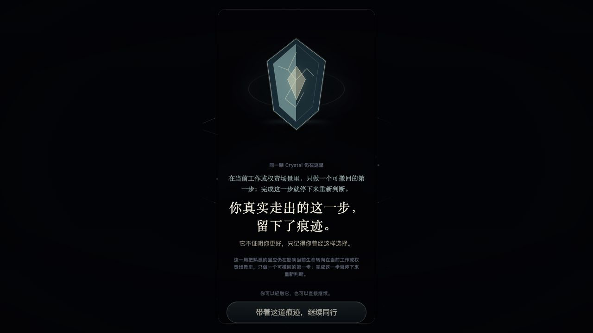
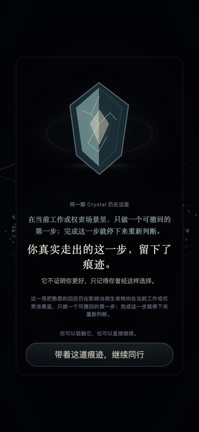
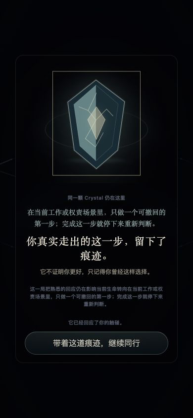

# XINMAI Phase 3 Crystal Formation Ownership Moment Visual Major Blade C1 P0

> 任务编号：`XINMAI-PHASE-3-CRYSTAL-FORMATION-OWNERSHIP-MOMENT-VISUAL-MAJOR-BLADE-C1-P0`
>
> 交通灯：YELLOW
>
> 刀型：Visual Interaction Major Blade
>
> 决策：`NOW — STRICT SCOPE`
>
> 精确基线：`fcf9e672e46d2e807315cfb797bf437ee3d1f6ea`
>
> Runtime：AUTHORIZED
>
> Push：HOLD
>
> Phase 4：LOCKED

---

## 一、交付裁决

```text
Runtime Structure：
PASS

Authority Boundary：
PASS / UNCHANGED

Canonical Body Imprint：
UNCHANGED

Visual Readability：
PASS — RECOVERED OWNERSHIP

Current-transaction Formation Capture：
OPEN — 需下一条正式现实回应

Native Reduced Motion Device Evidence：
OPEN — 当前浏览器原生偏好为 false

Runtime Candidate：
OPEN — VISUAL EVIDENCE INCOMPLETE

Push：
HOLD
```

当前没有发现 Runtime 缺陷、双权威、Legacy 回流或 Renderer 反向消费。未关闭项只属于正式首次形成和原生 Reduced Motion 的浏览器视觉证据，不授权用 Fixture、参数或 DOM 修改补造。

---

## 二、完成的 C1 结构

```text
Formation Receipt + Canonical Crystal
↓
XinmaiCrystalOwnershipPresentationResolver
↓
XinmaiCrystalOwnershipPresentationDecision
↓
XinmaiCrystalFormationOwnershipMoment
↓
用户轻触或主动继续
```

五态已经冻结并实现：

- `FORMATION_PENDING`
- `FORMATION_CONFIRMED`
- `OWNERSHIP_PRESENTED`
- `RECOVERED_EXISTING`
- `SAFE_WITHHELD`

规则：

- 成功只接受 `IDB_TRANSACTION_COMPLETE`；
- `FORMATION_CONFIRMED` 只属于本页面周期收到的新事务结果；
- Canonical Recovery 永远进入 `RECOVERED_EXISTING`，不重播首次高潮；
- 轻触只更新 typed Presentation interaction，不写 Authority；
- WebGL 不可用时，SVG Crystal 仍保留完整 Ownership；
- C1 没有声音、触觉、Body Imprint 或 Phase 4 消费者。

---

## 三、视觉实现

### 3.1 三拍

```text
松开：
局部收紧场回落，不做全屏爆发

凝结：
10 个固定、短生命周期碎片向中心汇聚

拥有：
天青深水材质 Crystal 稳定停留在首屏主位
```

Crystal 使用稳定 SVG 表面：

- 不依赖 Renderer 或 Canvas；
- 汝窑式开片只承担材质识别，不承担资产状态；
- 无金币、宝箱、稀有度、数量或奖励弹窗；
- 轻触有一次纯视觉回应，但不是确认步骤；
- 用户可以不触碰，直接主动继续。

### 3.2 文案

```text
你真实走出的这一步，留下了痕迹。

它不证明你更好，只记得你曾经这样选择。
```

没有新增 AI 文案调用，没有展示 Receipt、Eligibility、六维或工程术语。

---

## 四、正式浏览器证据

正式 Origin：`http://127.0.0.1:5217`

正式 Canonical 资产：

```text
formationReferenceId：crystal-formation:1euwihp
crystalReferenceId：crystal:z68jbn
successAuthority：IDB_TRANSACTION_COMPLETE
presentationOrigin：CANONICAL_RECOVERY
authorityWriteback：FORBIDDEN
```

### 4.1 桌面恢复态



结果：

- Crystal 位于首屏主位；
- 现实行动、Crystal 和 Ownership 文案在同一因果轴；
- 继续入口可见；
- Recovery 没有重播 Formation 动画。

### 4.2 390 × 844 窄视口



真实尺寸检查：

```text
viewport：390 × 844
surface：327.6 × 620
Crystal：167.7 × 201.2
Continue button bottom：716.1
horizontal overflow：false
pointer-events：auto
```

Crystal、来源行动、主辅文案和继续入口均未裁切。

### 4.3 Ownership 轻触



真实按钮点击结果：

```text
data-ownership-interaction：PRESENTED
aria-pressed：true
页面反馈：它已经回应了你的触碰。
Growth writeback：0
```

### 4.4 Back / Forward 与多标签

真实浏览器完成：

```text
Ownership → /reality
→ Back
→ RECOVERED_EXISTING / crystal:z68jbn
→ Forward /reality
→ Back
→ RECOVERED_EXISTING / crystal:z68jbn
```

第二标签读取结果：

```text
state：RECOVERED_EXISTING
crystal：crystal:z68jbn
authority：IDB_TRANSACTION_COMPLETE
```

没有第二 Crystal、没有再次 Formation、没有 Recovery ID 漂移。

### 4.5 静态降级

```text
Ownership 内部 Canvas：0
SVG Crystal：1
WebGL 依赖：0
```

因此 WebGL 失败不会删除 Crystal、归因或继续入口。

当前浏览器：

```text
prefers-reduced-motion: reduce = false
```

没有使用查询参数、Fixture、手工事件或 DOM 状态修改伪造 Reduced Motion。CSS 和 typed decision 已建立语义同一的静态模式；原生设备证据保持 Push Gate 黄灯。

---

## 五、Authority 与禁止扩张复核

```text
新 Storage：0
新 IndexedDB / Object Store：0
低层 Formation 直接调用：0
Renderer 读取 Receipt / Crystal：0
DOM / data-* 作为输入：0
动画回写 Formation：0
PersonalityRingLite 新消费：0
Canonical Body Imprint 修改：0
声音 / 触觉：0
Phase 4：0
```

`data-*` 只作为浏览器验收镜像，不参与 Resolver 输入。

---

## 六、工程验证

```text
TypeScript + Production Build：PASS
Crystal Ownership Presentation Gate：PASS
Lived Growth Authority Suite：PASS
Canonical Body Imprint Suite：PASS
Reality Adventure Continuity：PASS
Gravity Choice Presentation Readiness：PASS
Production Bundle Development Acceptance：0
git diff --check：PASS
```

新增 Gate 已注册到正式 `check:xinmai-lived-growth-authority` 命令。

---

## 七、Forward Static-Safe 回滚边界

候选内提供唯一 Presentation Policy：

```text
ENABLED
STATIC_CONFIRMATION_ONLY
```

Forward Counter 只能把 Policy 推进到：

```text
STATIC_CONFIRMATION_ONLY
```

结果：

- Receipt、Crystal、Eligibility 与 Handoff 保留；
- Formation Motion 与触碰动画停止；
- 静态 Crystal、来源行动和 Ownership 文案保留；
- 不恢复旧文字成功旁路；
- 不恢复 `PersonalityRingLite`；
- 不影响 Blade A / Blade B。

---

## 八、Push Gate 剩余证据

只剩两项视觉证据，不需要修改 Runtime：

1. 下一条正式现实回应形成新 Crystal 时，记录 `FORMATION_CONFIRMED → OWNERSHIP_PRESENTED`；
2. 在原生 Reduced Motion 设备上确认同一 Receipt / Crystal / 文案 / 继续入口。

禁止为了补齐证据：

- 使用 Acceptance 或 Fixture；
- 修改 DOM 属性；
- 用 URL 参数模拟状态；
- 重播 Canonical Recovery 冒充首次 Formation；
- 修改 Growth Authority。

最终出口保持：

```text
Runtime Candidate：OPEN — VISUAL EVIDENCE INCOMPLETE
Push：HOLD
Phase 3：ACTIVE / NOT PASSED
Phase 4：LOCKED
```
