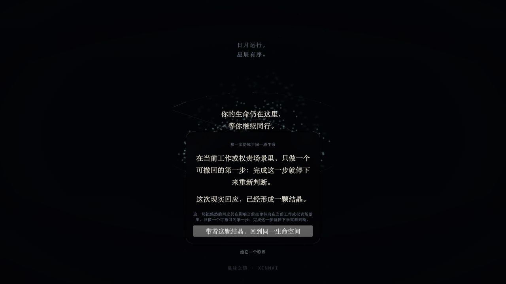
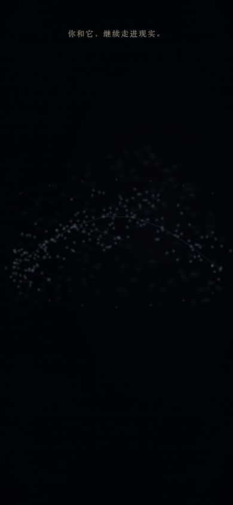
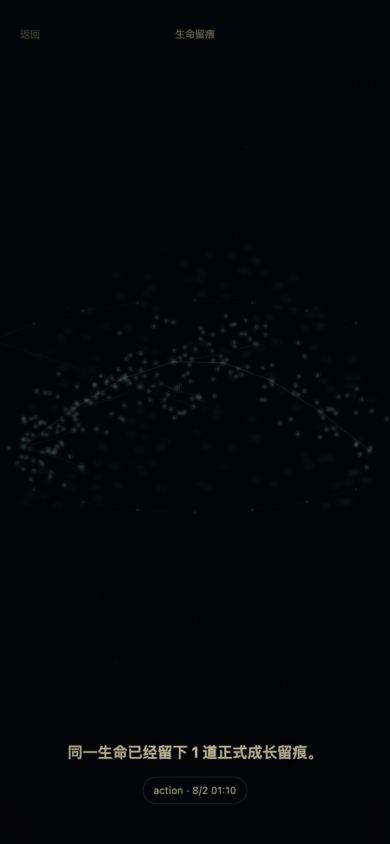
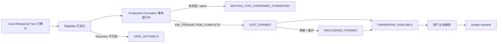
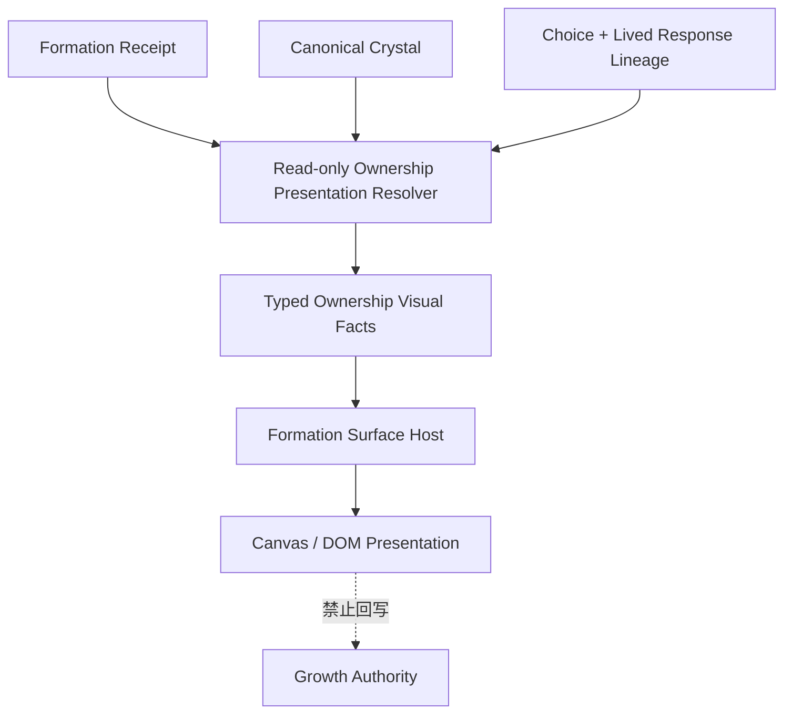

# XINMAI Phase 3 Crystal Formation + Same-Life Body Imprint Ownership Moment Visual Interaction Major Blade Readiness P0

> 任务编号：`XINMAI-PHASE-3-CRYSTAL-FORMATION-SAME-LIFE-BODY-IMPRINT-OWNERSHIP-MOMENT-VISUAL-INTERACTION-MAJOR-BLADE-READINESS-P0`
>
> 交通灯：YELLOW
>
> 刀型：Visual Interaction Major Blade Readiness
>
> 决策：`NOW — PREP ONLY`
>
> 审查基线：`c5e1a192eb27cb64644c72685516f0fd6d0bde8e`
>
> 远程分支：`origin/codex/genesis-28-mansion-production-continuity`
>
> Runtime / Renderer / Authority / Gate：只读，未修改
>
> Phase 3：`ACTIVE / NOT PASSED`
>
> Phase 4：`LOCKED`

---

## 一、唯一目标与最终裁决

本刀只冻结如何把已经成立的技术事实转化为用户能直接感受到的三件事：

```text
我真实做了一步
↓
这一步形成了属于我的 Crystal
↓
它留在了同一星兽的生命身体上
```

最终裁决：

```text
Formation / Crystal Authority：
CLOSED / UNCHANGED

Canonical Body Imprint Authority：
CLOSED / UNCHANGED

Renderer 输入迁移：
NOT REQUIRED

只读 Presentation Resolver：
REQUIRED

当前视觉因果可读性：
OPEN

C1 / C2 / C3 分刀与回滚边界：
FROZEN

Readiness 出口：
NOW — VISUAL MAJOR BLADE APPLICATION READY
```

本次没有发现成长事实到视觉之间的第二权威。现有 typed facts 足以支持视觉施工；后续只允许新增只读 Presentation 决策与视觉表现，不得修改 Canonical Authority。

---

## 二、当前正式视觉基线

### 2.1 Formation / Ownership 当前表面



已经成立：

- 只有 Formation 事务完成后才出现 Crystal 成功语义；
- 页面能够说明本次现实回应已经形成 Crystal；
- 用户可以继续进入同一生命空间；
- 当前页面没有把 Body Imprint 或 Phase 4 圣所混入成功声明。

当前体验缺口：

- Crystal 主要由文字卡片宣告，用户看不到一个清晰、可拥有的 Crystal 对象；
- “现实回应 → 形成”缺少空间因果，像系统告知而不是用户亲眼看见；
- 行动、Choice lineage 与 Crystal 的归因没有形成一个三秒内可复述的视觉句子；
- 继续按钮与形成时刻处于同一认知层，用户可能直接离开而错过拥有感。

裁决：

```text
技术成功：可见
Crystal 形成：不可见
Crystal 所有感：不足
```

### 2.2 Reality 当前 Canonical Imprint



已经成立：

- Reality 消费 Canonical Body Imprint typed facts；
- 留痕与同一 Identity、StarBeast Body Reference、Receipt 和 Crystal 绑定；
- 页面不再使用 `PersonalityRingLite` 决定身体归属。

当前体验缺口：

- 留痕与通用星尘、弧线和背景亮点难以区分；
- 用户无法在返回后的前两秒定位“身体哪里发生了变化”；
- 同一星兽的生命核心、能量骨相和身体边界尚不足以承载局部改变；
- 当前可见强度接近需要用户猜测的隐现，不足以证明“它记得”。

### 2.3 Archive 当前 Canonical Imprint



已经成立：

- Archive 能恢复正式留痕数量与来源；
- 历史视图不反向生产 Body Imprint；
- Canonical Imprint 与 Legacy History 已经语义分离。

当前体验缺口：

- 主要信息形态仍像历史清单或资产记录；
- 用户能知道“有一道”，但不能从同一生命身体上重新认出它；
- Archive 排序与身体归属已经技术解耦，但感知上尚未建立“同体回看”。

### 2.4 Returning Life Space 补充证据


该补充证据显示：窄视口中的同一生命空间接近纯暗场，当前 Body Imprint 不具备第一认知层可读性。它不能作为三个正式页面之外的第四种权威，只用于确认 C2 必须覆盖正式 Returning Host 的窄视口表现。

### 2.5 基线总结

```text
系统现在确实形成了 Crystal
但用户主要读到一句“已经形成”

系统现在确实恢复了 Canonical Body Imprint
但用户主要看到一片极暗生命空间

系统现在确实跨页面恢复同一集合
但用户尚未感到“同一生命记得”
```

因此，Blade C 的目标不是添加更多粒子，而是把已成立事实置于正确的视觉层级。

---

## 三、体验因果宪法

后续视觉施工必须遵守：

```text
事实先于表现
表现不生产事实
形成先于庆祝
拥有先于继续
同体变化先于历史清单
```

禁止：

- Formation 事务完成前出现 Crystal 成功；
- 用动画结束回写 Growth Authority；
- 用按钮点击、计时器、DOM 或 Canvas 帧确认 Formation；
- 用“焦虑被看见”替代“现实回应被确认”；
- 把 Crystal 做成金币、抽卡稀有物或任务奖励；
- 为形成高潮提前引入 Phase 4 星轨、收藏墙或圣所；
- 在 Body Imprint 不可读时用文案声称身体已经改变。

---

## 四、Formation 前后因果时间线

### 4.1 正式时间线



### 4.2 Presentation State

| 状态 | 唯一事实输入 | 用户可见语义 | 禁止行为 |
|---|---|---|---|
| `WAITING_FOR_CONFIRMED_FORMATION` | Fact + Eligibility，尚无 Receipt | 留痕仍在形成或可安全重试 | 显示 Crystal 成功、进入完整闭环 |
| `JUST_FORMED` | 当前页面周期收到 post-commit typed outcome | 第一次看见 Crystal 凝结 | 从计时器、动画或请求 success 推断 |
| `RECOVERED_FORMED` | Recovery 已有 Receipt + Crystal | 静态恢复同一颗 Crystal | 伪装成刚刚再次形成 |
| `OWNERSHIP_AVAILABLE` | Receipt + Crystal + lineage 完整 | 这颗 Crystal 属于这次现实回应 | 要求触碰才能让资产“成立” |
| `HANDOFF_READY` | Ownership 已可见，用户主动继续 | 回到同一生命空间 | 自动倒计时跳页吞掉拥有时刻 |
| `SAFE_WITHHELD` | Recovery / identity / lineage 不可信 | 克制说明尚不能确认留痕 | Legacy 回退、伪造 Crystal |

### 4.3 事务与视觉边界

```text
IDB transaction complete 之前：
允许等待、呼吸、真实失败反馈
禁止 Crystal 成功、金石音和形成触觉

IDB transaction complete 之后：
允许 JUST_FORMED
允许一次短促形成表现
允许明确展示来源行动和 Choice lineage

刷新中断形成表现：
恢复 RECOVERED_FORMED
不重播为一次新的 Formation

动画失败：
显示静态 Ownership
不得阻断 /reality Handoff
```

---

## 五、Crystal Ownership 状态与感知设计

### 5.1 单向决策链



虚线箭头表示被禁止的方向。

### 5.2 首次出现位置与尺度

冻结方向：

- Crystal 首次出现于生命核心与现实回应文本之间的中心因果轴，不放在右上角、背包位或 toast；
- 窄视口以可触达但不遮挡来源文本的中心下移位置呈现；
- 首次稳定尺度至少占短边 `12%`，不得小于主要正文中的单行高度；
- Crystal 必须是可辨认的独立物体，同时保留与生命核心相同的色谱和能量纹理；
- 不出现数量、稀有度、等级、市场价值或抽取概率。

### 5.3 归因内容

Ownership 表面只需回答：

```text
你真实尝试了什么
↓
这次回应形成了哪一颗 Crystal
↓
它将留在同一生命的哪里
```

不得把长篇用户原文、AI 解释或道德评分置于形成高潮。

建议的最小归因结构：

- 现实回应：一行用户确认事实的精简视图；
- Crystal：可视对象 + typed crystal identity；
- 同体去向：一句“它会留在同一生命上”的事实说明；
- 下一动作：用户主动进入同一生命空间。

### 5.4 触碰、声音与触觉

- 触碰可以让用户回看来源或获得一次细微反馈，但不是 Ownership 成立的必要动作；
- 金石音只能在事务完成后、符合浏览器音频政策时播放，建议时长不超过 `600ms`；
- 触觉只允许在用户手势后发生一次 `10–20ms` 的轻触；
- 无声音或触觉时，视觉与文案必须独立完整；
- 禁止自动长音乐、连续震动、老虎机升调或粒子爆奖。

---

## 六、Motion / Reduced Motion 双方案

### 6.1 Motion

建议总时长 `1.6–2.4s`，只播放一次：

| 时间 | 因果表达 | 允许效果 |
|---|---|---|
| `0–350ms` | 收紧释放 | 核心周围局部张力回落，背景不进行全屏推进 |
| `350–900ms` | 现实回应汇入 | 一条来源明确的能量丝从回应锚点向中心收束 |
| `900–1600ms` | Crystal 凝结 | 可辨认晶体由雾态转为稳定实体，一次局部折射或金石响应 |
| `1600ms+` | Ownership 稳定 | 来源文本、Crystal 与继续入口同时稳定可读 |

禁止循环播放 Formation。用户停留时只保留极轻的生命呼吸，不再重复凝结。

### 6.2 Reduced Motion

```text
事务完成
↓
单次静态显影
↓
Crystal 实体、来源行动和同体去向同时可读
```

Reduced Motion 不是：

- 把 Motion 压缩到 `80ms`；
- 快速闪烁或亮度跳变；
- 删除 Crystal 或 Body Imprint；
- 只剩一句“形成成功”。

它必须与 Motion 产生完全相同的：

- Crystal ID；
- Imprint ID；
- Ownership 归因；
- 继续入口；
- Growth 结果。

---

## 七、Same-Life Body Imprint 层级与落点

### 7.1 视觉层级

```text
Layer 0：生命身体轮廓与能量骨相
Layer 1：生命核心与七脉基础流动
Layer 2：Settled Canonical Imprints
Layer 3：Current Formation Focus
Layer 4：极短来源提示与触碰回看
```

新留痕只能叠加到同一身体，不得创建第二星兽、皮肤卡片或悬浮徽章。

### 7.2 唯一落点规则

Body Imprint 位置只能由现有 typed facts 派生：

```text
bodyReferenceId
+ sourceSlot
+ deterministicGeometryKey
+ projectionVersion
↓
稳定身体区域与几何
```

禁止依据：

- `createdAt`；
- 数组第一项或最后一项；
- Archive 排序；
- 当前页面选中项；
- `crystal.copy`；
- Renderer 帧、DOM 位置或 AI 判断。

### 7.3 可读性目标

以下是后续 Blade C2 的验收目标，不是当前已达成指标：

- 当前形成焦点与局部身体背景的对比度目标不低于 `3:1`；
- 已沉积历史留痕的局部对比度目标不低于 `1.8:1`；
- 禁止用约 `5%` 不透明度承担主要成长事实；
- 当前焦点影响区域不超过身体可见轮廓的 `12%`；
- 单道沉积留痕不超过身体可见轮廓的 `8%`；
- 留痕可以改变局部脉络、材质和流向，但不得覆盖生命核心和原始骨相；
- Returning 首屏两秒内，用户无需打开 Archive 即可定位新变化。

### 7.4 多颗 Crystal

- 所有合法 Canonical Imprint 作为集合消费，不按时间选“最新一颗”决定归属；
- 当前回合可使用现有 `focusedImprintReferenceId` 形成局部聚焦；
- 历史 Imprint 保持较低层级但可见；
- 聚焦结束只改变 Presentation 强度，不改变 Imprint ID、位置或 Authority；
- 多颗 Crystal 形成身体脉络的累积，不形成收藏墙、徽章行或稀有度阶梯。

---

## 八、Typed Visual Facts 消费契约

### 8.1 允许输入

只读 Presentation Resolver 只能消费：

- confirmed Formation Receipt；
- Canonical Crystal；
- Canonical Body Imprint decision / facts；
- Choice 与 Lived Response lineage 的只读归因；
- Motion Preference；
- Performance Tier。

建议新增两个只读类型：

```text
XinmaiCrystalOwnershipPresentationDecision
XinmaiSameLifeBodyImprintPresentationDecision
```

它们不得持久化，也不得成为提交凭证。

### 8.2 字段责任

| 输入 / 输出 | 分类 | 责任 | 禁止用途 |
|---|---|---|---|
| Formation Receipt | Authority Fact | 证明 Formation 已正式完成 | 用 Presentation 改写 projection 状态 |
| Canonical Crystal | Authority Fact | 提供 Crystal identity 与正式资产 | 用 copy、颜色或视觉稀有度反推资格 |
| Canonical Body Imprint | Authority Fact | 提供同体归属与确定性几何 | 依据数组顺序重新选择身体归属 |
| Choice / Fact lineage | Authority Fact | 解释 Crystal 来自哪次现实回应 | 评价用户成功或道德价值 |
| Motion Preference | Presentation Hint | 选择连续变化或静态显影 | 改变 Growth 结果 |
| Performance Tier | Presentation Hint | 降级粒子、折射和拖尾 | 删除 Crystal 或 Imprint 可读性 |
| reveal phase | Presentation State | 当前一次展示节奏 | 持久化为 Growth 事实 |
| focus strength | Presentation State | 当前 Imprint 局部强调 | 改写 canonical geometry |
| sound / haptic eligibility | Presentation State | 判断是否可增强反馈 | 宣布成功 |

### 8.3 消费者矩阵

| 消费者 | 裁决 | Blade | 目标责任 |
|---|---|---|---|
| `XinmaiLivedResponseReturnSurface` | ADAPT | C1 | 消费 Ownership decision，不再只靠文本卡片表达 Formation |
| Formation Production Orchestrator | KEEP | 无 | 继续唯一形成编排，不接收视觉回写 |
| `LaunchLab` | ADAPT | C2 | 透传同一 Imprint presentation facts，保持 Returning 同体可读 |
| `RealityProductionRouteEntry` | ADAPT | C2 | 只读恢复并透传 typed facts |
| `RealityProductionHost` | ADAPT | C2 | Host 只转发，不选择 Crystal 或 Imprint |
| `RealityLifeUniverseCanvas` | ADAPT | C2 | 使用 typed facts 强化局部同体留痕，不读 Storage / DOM |
| 正式 `/archive` | KEEP / CALIBRATE | C2 | 保持历史只读；只校准同一 typed facts 的回看关系 |
| `PersonalityRingLite` | REJECT AS BODY INPUT | 全部 | 仅保留合法历史兼容，不得回到身体权威 |
| Renderer / Canvas Frame | REJECT AS AUTHORITY | 全部 | 只输出画面，不生产 Formation 或 Imprint |
| DOM / `data-*` | REJECT AS INPUT | 全部 | 只允许测试观测镜像，不反向消费 |

### 8.4 Renderer 边界裁决

当前 Renderer 已能消费 typed Canonical Body Imprint facts，不需要新的 Storage、DOM 或 Legacy 输入迁移。

```text
Renderer input migration：
NOT REQUIRED

Renderer presentation refinement：
REQUIRED IN C2
```

若 C1/C2 实施中发现必须从 Storage、DOM、`PersonalityRingLite` 或页面布尔值补足视觉事实，立即停刀并升级：

```text
RED — MIGRATION AUDIT
```

---

## 九、性能与降级矩阵

| 档位 | Formation 预算 | Body Imprint 预算 | 保留事实 |
|---|---|---|---|
| HIGH | 最多约 240 个短生命周期粒子；一次局部折射；单层局部 bloom；DPR 上限 1.5 | 当前焦点局部脉络、一次轻微材质流动 | Crystal、来源、同体落点、继续入口全部保留 |
| MEDIUM | 最多约 96 个粒子；无折射；单层发光；DPR 上限 1.25 | 静态脉络 + 轻呼吸 | 与 HIGH 相同的事实和归因 |
| LOW | 最多约 24 个粒子；无拖尾、折射和 bloom | 静态 Crystal + 高对比局部 Imprint | Formation、Ownership、Body Imprint 三个因果点全部保留 |
| WEBGL UNAVAILABLE | SVG / DOM 静态 Crystal 确认 | SVG / DOM 同体留痕表面 | 不阻断已形成资产与 `/reality` Handoff |

降级顺序冻结：

```text
粒子数量
→ 拖尾
→ 折射
→ bloom
→ 非必要背景运动
```

禁止降级：

- Crystal 实体；
- 来源行动归因；
- 同体 Body Imprint；
- Ownership 继续入口；
- 真实失败与 Safe Withheld 表达。

视觉加载失败时必须直接落到静态 typed surface，不得延迟或撤销已形成 Crystal。

---

## 十、C1 / C2 / C3 单提交与回滚边界

### 10.1 Blade C1 — Crystal Formation + Ownership Moment

建议新增：

```text
src/types/xinmaiCrystalOwnershipPresentation.ts
src/services/xinmaiCrystalOwnershipPresentationResolver.ts
src/components/XinmaiCrystalFormationOwnershipMoment.tsx
src/styles/xinmai-crystal-formation-ownership-moment.css
```

建议修改：

```text
src/components/XinmaiLivedResponseReturnSurface.tsx
src/main.tsx（仅样式入口，如组件不自行引入样式）
scripts/check-xinmai-crystal-ownership-presentation.mjs
package.json（注册正式 Gate alias）
```

回滚单位：

```text
Formation Presentation → STATIC_CONFIRMATION_ONLY
Receipt / Crystal / Eligibility → 保留
/reality Handoff → 保留可重试
旧 Fact 后直接成功导航 → 不复活
PersonalityRingLite → 不复活
```

### 10.2 Blade C2 — Same-Life Body Imprint Presentation

建议新增：

```text
src/types/xinmaiSameLifeBodyImprintPresentation.ts
src/services/xinmaiSameLifeBodyImprintPresentationResolver.ts
src/styles/xinmai-same-life-body-imprint.css
```

建议修改：

```text
src/components/RealityLifeUniverseCanvas.tsx
src/components/RealityProductionHost.tsx
src/pages/LaunchLab.tsx
src/pages/RealityProductionRouteEntry.tsx
src/pages/PersonalityRingPage.tsx（仅同一 typed facts 回看校准）
scripts/check-xinmai-same-life-body-imprint-presentation.mjs
package.json
```

回滚单位：

```text
Body Imprint Presentation → 静态 typed Imprint
Canonical Imprint Recovery → 保留
Formation Receipt / Crystal → 保留
Legacy Body Authority → 不恢复
createdAt / 数组顺序选择 → 不恢复
```

### 10.3 Blade C3 — Sound / Haptic / Motion / Performance Refinement

建议新增：

```text
src/types/xinmaiOwnershipSensoryPresentation.ts
src/services/xinmaiVisualPerformanceTierResolver.ts
src/services/xinmaiOwnershipSensoryCuePolicy.ts
src/styles/xinmai-ownership-sensory-refinement.css
```

建议修改范围只限 C1/C2 新表面与直接样式消费者。

回滚单位：

```text
Sound / Haptic / Motion → OFF
Static Formation Ownership → 保留
Static Canonical Body Imprint → 保留
Growth / Crystal / Imprint Authority → 不变
```

### 10.4 原子纪律

- C1、C2、C3 各自独立提交、独立 Gate、独立真实浏览器验收；
- C1 不得顺带改 Body Imprint；
- C2 不得重写 Formation 或加入 Phase 4 Archive Growth；
- C3 不得以声音或性能策略改变业务结果；
- 任一刀失败使用 forward static-safe counter，不普通 revert 恢复旧假视觉权威。

---

## 十一、禁止消费者门禁

后续施工至少建立：

1. `Transaction Complete Before Visual Success Gate`
2. `Formation Visual Fact Authority Gate`
3. `Crystal Ownership Lineage Attribution Gate`
4. `Canonical Body Imprint Typed Facts Only Gate`
5. `DOM / data-* Runtime Input Forbidden Gate`
6. `PersonalityRingLite Body Authority Forbidden Gate`
7. `CreatedAt / Array Order / Crystal Copy Selection Forbidden Gate`
8. `Motion / Reduced Motion Semantic Parity Gate`
9. `WebGL Static Fallback Gate`
10. `Presentation Authority Writeback Forbidden Gate`
11. `Audio / Haptic Success Authority Forbidden Gate`
12. `Phase 4 Sanctuary Boundary Gate`

Gate 只能检查消费者和边界，不能用精确源码文案成为产品真相。

---

## 十二、真实浏览器验收矩阵

### 12.1 C1

- 正式已尝试形成 `JUST_FORMED`；
- 改变回应形成相同权威、不同真实来源的 Crystal；
- 未尝试 / 拒绝记录不进入 Ownership；
- transaction complete 前 Crystal 成功视觉为零；
- 刷新中断后恢复 `RECOVERED_FORMED`，不假装再次形成；
- Formation 成功、导航失败只重试 Handoff；
- Motion 与 Reduced Motion 使用同一 Receipt / Crystal / lineage；
- WebGL 不可用仍有静态 Crystal 与来源归因；
- 用户无需等待动画结束即可在事实成立后主动继续。

### 12.2 C2

- Returning 首屏两秒内能定位当前 Body Imprint；
- 用户确认是同一 StarBeast，不是第二主体或皮肤；
- 多颗 Imprint 全部保留，当前焦点明确但不覆盖历史；
- 刷新、Back/Forward、多标签后 Imprint ID、位置和集合一致；
- Archive 排序变化不改变身体位置；
- Identity / Body Reference 失配进入 `SAFE_WITHHELD`；
- Legacy-only 数据不显示 Canonical Body Imprint；
- Motion / Reduced Motion / Static Fallback 消费同一 typed facts；
- Canvas 不直接读取 Storage、DOM 或 `PersonalityRingLite`。

### 12.3 C3

- 声音与触觉关闭时，用户理解率不下降为不可用；
- 原生 Reduced Motion 设备验证无快速闪烁、强制空间位移或伪完成；
- 高、中、低档位都保留三个因果点；
- 低端设备上视觉加载失败不阻断 `/reality`；
- 音频策略被拒绝时无报错、无成功状态差异；
- 连续返回不重复播放 Formation 成功声或触觉。

---

## 十三、商业体验验收标准

以下为 Blade C4 用户研究目标，不是当前已经取得的数据：

| 问题 | 目标 |
|---|---|
| 用户能否在三秒内说出 Crystal 来自哪次现实行动 | 正确归因率 `≥ 80%` |
| 用户是否理解“尝试”而不是“成功”形成成长事实 | 正确理解率 `≥ 80%` |
| Returning 是否确认这是同一只 StarBeast | 同一生命识别率 `≥ 90%` |
| Returning 两秒内能否找到身体变化 | 留痕定位率 `≥ 75%` |
| 是否误认为积分、签到、抽卡或 AI 奖励 | 错误分类率 `≤ 15%` |
| 是否愿意因为“它会记得”再次回来 | 正向意愿 `≥ 50%` |

商业边界冻结：

```text
免费用户：
必须完整经历第一轮 Identity → Relationship → Reality Adventure
→ Real-world Action → Crystal → Body Imprint

未来付费价值：
持续 Encounter
长期生命圣所
历史回看
更丰富但不改变事实的声音、触觉与生命世界表现
```

禁止在 Crystal 形成前收费，禁止付费生成 Crystal、购买行动成功、解除星兽痛苦或使用脆弱状态限时转化。

真正可商业化的核心不是更多特效，而是：

> 一个持续记住、呈现并见证用户真实改变的生命世界。

---

## 十四、刀后交通灯与阶段边界

```text
GREEN：
Formation Receipt、Canonical Crystal、Canonical Body Imprint、typed facts

YELLOW：
Formation 可视因果、Ownership 重量、Body Imprint 可读性、
低端性能、原生 Reduced Motion、声音与触觉节奏

RED 触发条件：
施工需要 Storage / DOM / Legacy Mirror 补足视觉事实
Renderer 反向写入 Authority
Presentation 需要改变 Crystal / Imprint canonical identity
```

继续保持：

```text
Phase 3：ACTIVE / NOT PASSED
Phase 4：LOCKED
mother-code-profile：独立 YELLOW / BASELINE MAP
六维 / 东方观察 Ontology：不混入本刀
AI：不进入视觉事实或 Shader Authority
订阅墙：不施工
```

---

## 十五、最终出口与下一刀序

```text
事实边界：
CLEAR

体验节奏：
FROZEN

Typed Visual Facts 消费边界：
FROZEN

性能与 Reduced Motion：
FROZEN FOR APPLICATION

独立回滚单位：
C1 / C2 / C3 FROZEN

最终出口：
NOW — VISUAL MAJOR BLADE APPLICATION READY
```

固定刀序：

```text
Blade C1：
Crystal Formation + Ownership Moment
↓
独立 Push Gate / Closure Revalidation
↓
Blade C2：
Same-Life Body Imprint Presentation
↓
独立 Push Gate / Closure Revalidation
↓
Blade C3：
Sound / Haptic / Motion / Performance Refinement
↓
Blade C4：
Phase 3 Experience & Commercial Closure Audit
```

即使 C1/C2/C3 全部通过，也不得自动解锁 Phase 4；Phase 3 只有在用户真正理解、拥有并愿意回到这段生命连续性后，才可申请 `PASSED`。
