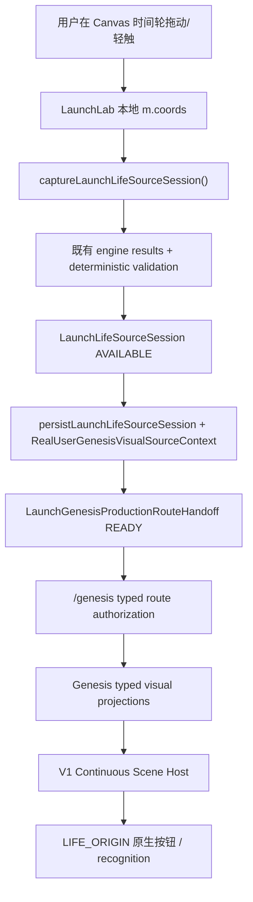

# XINMAI Phase 3｜Genesis Birth Coordinate Spatial Interaction MAP / PREP P0

```text
Task:
XINMAI-PHASE-3-GENESIS-BIRTH-COORDINATE-
SPATIAL-INTERACTION-MAP-PREP-P0

Traffic Light:
YELLOW → RED

Knife:
Visual Experience Architecture MAP /
Birth-input Consumer Migration Prep

Decision:
MAP CLOSED
RED MIGRATION AUDIT REQUIRED

Runtime / Renderer / CSS / Gate / Authority / Storage / Schema / Copy / Asset:
0 changes

Remote / Parent:
ad947bbdcdfefcd068536f4dcd7926464c914c8d

V1 Continuous Scene Host:
CLOSED / PASS

C1 / C2:
CLOSED / PASS

Phase 3:
ACTIVE / NOT PASSED

C3 Haptic:
PAUSED

Audio:
SAFE_WITHHELD / SILENT

Phase 4:
LOCKED

Push:
HOLD until exact document delivery authorization is satisfied
```

## 0. 结论

V2 的产品方向可以冻结，但不能直接进入普通视觉施工。

唯一推荐方向是：

```text
原生可访问的四项出生时间输入
→ 只读空间预览（尚不宣称身份）
→ 用户明确确认完整坐标
→ 既有 LaunchLifeSourceSession / engine authority 验证
→ 同一 sourceReference / render-plan 进入 Genesis
→ 同一 Continuous Scene Host 中显现 LIFE_ORIGIN
→ 用户通过真实原生控件认出，而不是点击任意 Canvas 空白区域
```

当前生产实现把出生坐标的本地可变值、Canvas 指针交互、空间绘制、感官反馈、正式 source session 创建和延迟导航耦合在 `LaunchLab.tsx` 内。这个边界不是纯 CSS 或 renderer calibration：若只改画面，会继续保留 Canvas 作为事实输入和成功入口；若只加 DOM 表单，会形成双输入消费者。因此 V2 下一刀必须先做 **RED Migration Audit / Atomic Birth-input Consumer Cutover**。

本结论不推翻 V1、C1 或 C2：唯一 AppShell Scene Host、C2 Same-Life Presenter、Canonical Body Imprint 与既有 Authority 均保持原样。V2 只负责 Birth → Genesis 的输入可理解性、空间因果和无双消费者切换。

## 1. 证据范围与限制

### 1.1 用户提供的五张当前视觉证据

| Step | 证据 | 画面事实 | 健康度 | 产品判断 |
|---|---|---|---|---|
| 1 | `codex-clipboard-a736da21-8e4a-4a3a-9560-8cb9ccc23c8c.png` | 深色星河、中心光核、28 宿环形秩序、入口文案 | `PARTIAL PASS` | 视觉主题与世界尺度已可辨，但闭合外环仍比生命对象更先被看见；这不是 C2 身体，也不得成为第二身体或身份权威。 |
| 2 | `codex-clipboard-7cf162cc-ef79-46a3-a2ab-40763bc12d05.png` | 出生时间四列与中心天体同屏，底部“轻触星河，确认生命坐标” | `PARTIAL` | 输入值可读，但控件实质是 Canvas pointer；屏幕上看似表单，语义树和键盘/读屏无法确认同等操作责任。空间回应与最终确认挤在同一模糊点击表面。 |
| 3 | `codex-clipboard-57994169-a153-49ff-8fd3-443b50b8e9b8.png` | 近乎全黑，只剩“轻触星河” | `FAIL` | 空黑等待把同一世界切断；文字成为唯一对象，用户无法判断要触摸何处、为何触摸或当前是否仍是同一生命。 |
| 4 | `codex-clipboard-8e898502-a08b-48bb-bb5f-d5e00cdde41d.png` | 近乎全黑，只剩“出生宿正在回应天地方位。” | `FAIL` | 内部阶段说明替代可见物理变化；Presentation timer/阶段推进对用户不可解释。 |
| 5 | `codex-clipboard-4e99f520-adc7-466e-8576-c01563da42fb.png` | 顶部“南方朱雀 · 星宿”，底部身份文案和大胶囊按钮裁切 | `FAIL` | 身份文本与操作挤出视口，空间主体不可见；视觉层级变回字幕卡。低视力、窄视口和真实命中区风险明确。 |

这五张图由用户明确提供，可用于本 MAP；它们不是本刀重新运行浏览器形成的证据。本刀按授权没有启动浏览器、Android、Figma 或 ImageGen，也不从截图宣称完整无障碍合规。

### 1.2 当前源码真源

审计读取了当前远程基线中的：

- `src/pages/LaunchLab.tsx`
- `src/pages/GenesisProductionExperiencePage.tsx`
- `src/components/GenesisProductionRendererCanvasHost.tsx`
- `src/types/launchLifeSourceSession.ts`
- `src/services/launchLifeSourceSession.ts`
- `src/services/launchGenesisProductionRouteHandoff.ts`
- `src/services/launchLifeSourceVisualAdapterInputBridge.ts`
- `src/types/xinmaiContinuousScenePresentation.ts`
- `src/styles/guanyao-visual-system.css`
- `src/styles/genesis-production-experience.css`
- `src/styles/xinmai-continuous-scene.css`
- 现有 Genesis / Birth / Continuous Scene gates。

## 2. 已关闭事实与仍开放边界

### 2.1 已关闭

1. V1 已建立 AppShell 级唯一 `XinmaiContinuousSceneHost`；正式路由不再各自拥有世界 Canvas / RAF 成功路径。
2. V1 公共 Outcome 只有：
   - `CONTINUOUS_SCENE_MOTION_PRESENTED`
   - `CONTINUOUS_SCENE_STATIC_PRESENTED`
   - `CONTINUOUS_SCENE_SAFE_WITHHELD`
3. C2 Same-Life Presenter 仍是需要身体时的唯一身体 proof，V2 无权创建第二身体。
4. Launch → Genesis 已存在正式 source/session/handoff/reference 连续性。
5. Genesis 的 LIFE_ORIGIN 操作已是原生 `button`，不需要 Canvas 自身冒充按钮。

### 2.2 仍开放

1. Birth input 仍由 `LaunchLab` 内 Canvas pointer 和本地 mutable `m.coords` 生产。
2. 画面中的四列“时间轮”不是原生表单控件，Canvas 没有为每一项提供可独立聚焦、命名、调整和确认的等价操作。
3. `captureLaunchLifeSourceSession()` 同时读取 Canvas state、调用 engine bridge、建立 real-user visual context 并持久化 session；Presentation 与正式来源建立耦合在页面闭包。
4. `beginProductionGenesisContinuity()` 依赖 `setTimeout` 延迟导航；定时可以驱动表现，但不得成为确认已成立或 route 可进入的权威。
5. Birth path 仍在 Canvas pointer 中调用旧 `audio.*` / `vibrate(...)`；C3 已暂停，V2 不得复制或新建感官路径。
6. Genesis 中部分阶段仍以整屏底部 status copy 表达，截图显示可退化为空黑字幕卡。

## 3. 当前正式因果链



当前 Authority 安全性主要由 `LaunchLifeSourceSessionService`、engine results、route handoff 与 Genesis authorization 保护；但用户输入值和确认意图在进入这条链之前由 Canvas local state 掌握。V2 不能把 Canvas local state升级为新的 Authority，也不能用新 Presentation Resolver替代既有 session/engine validation。

## 4. 生产者 / 消费者矩阵

| 层 | 当前生产者 | 当前消费者 | 正式事实 | 问题 | V2 冻结 |
|---|---|---|---|---|---|
| Birth editing | `LaunchLab` Canvas pointer + `m.coords` | 同一 Canvas renderer | 未确认编辑值 | 输入、视觉、指针和感官反馈同 Owner | 迁至原生可访问 input controller；仅产生 provisional input，不持久化、不宣称身份。 |
| Birth preview | `LaunchLab` draw loop | ENTRY_BIRTH scene | 预览 | 视觉上像正式坐标，但没有 clear provisional/confirmed boundary | 由纯 resolver 将 provisional input 映射到 FAR/MID/NEAR preview；明确“确认前只是预览”。 |
| Birth confirmation | Canvas outside-wheel tap → `commitCurrentDim()` | `captureLaunchLifeSourceSession()` | 用户确认完整坐标 | 任意 Canvas 空白区域可能成为提交入口；无独立 native confirmation contract | 唯一原生确认按钮；button click 是 intent，成功仍以既有 typed session result 为准。 |
| Source session | `createLaunchLifeSourceSession()` | visual source / Genesis route / Reality | `AVAILABLE` or `BLOCKED` | Authority 本身正确 | 不改算法、schema、writer；V2 只提供已确认 input。 |
| Persistence | `persistLaunchLifeSourceSession()` + real-user context activation | route recovery / consumers | source continuity | 页面闭包同时编排多步 | Audit 冻结唯一 orchestration boundary；页面不直接把 visual preview 当成功。 |
| Route handoff | `resolveLaunchGenesisProductionRouteHandoff()` | `navigate('/genesis')` | READY/BLOCKED | 导航被固定表现延迟包裹 | 只有 READY 才导航；transition hold 不产生 Authority；不得等待动画完成。 |
| Genesis delivery | production runtime automatically consumes accepted time | visual projections | typed coordinate/manif. state | 当前可出现 copy-only/black wait | 同一个 Host、同一 topology、相同 refs；每个阶段必须有可见对象变化或克制 static explanation。 |
| Life Origin | `GenesisProductionRendererCanvasHost` + typed completion | native `button` | discovery request | 当前 invitation 文案位置漂浮，截图中对象不可辨 | 保留 native button；绑定唯一 NEAR node；不让 Canvas 成为第二点击入口。 |
| Recognition | existing recognition state machine | native confirmation button | user recognition | 可在窄屏裁切并压过场景 | V2 仅校准 presentation/hierarchy；不改 recognition Authority。 |

`UNKNOWN = 0`。正式生产链中没有 AI/LLM 消费者；本刀也不引入。

## 5. 唯一产品交互合同

### 5.1 Public presentation states

以下状态只属于 Presentation，不是第二状态机；它们必须由现有 typed facts / admission 派生，禁止写 Storage 或反向推进 Authority。

| Public state | Typed input | 用户看到什么 | 唯一可用动作 | 禁止宣称 |
|---|---|---|---|---|
| `LIFE_WORLD_BASELINE` | ENTRY_BIRTH current admission；尚无 confirmed source | FAR 28 宿环境、MID 中心生命场；一段简短说明出生时间用于让同一星河找到位置 | “开始填写出生时间”原生控件 | 不宣称你的星宿、身份、母码或生命已形成。 |
| `BIRTH_COORDINATE_EDITING` | 四项 provisional values + validity | 四个原生有标签控件；NEAR 为当前编辑项，MID 对相应时间维度做低强度响应 | 调整年/月/日/时辰 | 不持久化、不调用正式 engine、不播放成功。 |
| `BIRTH_COORDINATE_READY` | 四项均 valid；仍未确认 | 完整可读摘要；空间只显示“可能落点”的预览，不突出唯一 birth mansion | “确认这个出生时间”原生按钮 | 不把 ready 当 AVAILABLE；不显示正式星宿/身份。 |
| `BIRTH_SOURCE_ACCEPTED` | existing `LaunchLifeSourceSession.status=AVAILABLE` + exact refs | 同一 FAR topology 中唯一落点由弱到稳；MID 核心回应；文字说明“时间已经被接受，正在进入同一片星河” | 无重复提交；等待 typed route handoff | 不由 timer/animation end 宣称 route ready。 |
| `LIFE_ORIGIN_AVAILABLE` | Genesis COMPLETION + route authorization + current refs | 同一 FAR/MID 连续；NEAR 唯一 Life Origin 节点清晰可见，按钮与节点空间相邻 | “轻触这束光”或现有等价 native button | 不靠空黑字幕、不在节点不可见时要求“轻触星河”。 |
| `LIFE_ORIGIN_RECOGNIZED` | existing recognition typed result READY | 生命主体与 source ref 保持；克制状态解释；可继续 Reality | existing native recognition / reality controls | 不生成 Crystal、Growth、人格定论或命运判断。 |
| `SAFE_WITHHELD` | invalid input、session blocked、source mismatch、stale admission、presenter unavailable | 保留可访问的输入/既有资产；真实说明暂时无法确认 | 修正输入、重试合法 typed action或返回 | 不使用默认身份、随机星宿、fixture 或模糊“成功”。 |

`BIRTH_SOURCE_ACCEPTED` 与 `LIFE_ORIGIN_AVAILABLE` 分属 Launch 和 Genesis，但用相同 source/reference 构成连续 Presentation；它们不持久化为新产品状态。

### 5.2 原生输入合同

V2 冻结以下唯一输入方向：

1. 年、月、日、时辰各有可聚焦的原生控件、明确 label、当前值和错误说明。
2. 日期边界沿用现有验证；月份或年份变化必须在 Presentation 中更新可选日期，不自动替用户确认新值。
3. 时辰向用户显示既有十二时辰标签；若保留 24 小时辅助值，必须说明映射，不用只读 Canvas 字形替代。
4. 出生地点在 1.0 不采集；不得显示虚构省市，也不得从设备位置推断。
5. 四项编辑完成后只进入 `BIRTH_COORDINATE_READY`；只有唯一原生确认按钮才能产生确认 intent。
6. 确认按钮的 handler 只能调用既有 typed orchestration；Canvas tap、背景 pointer、动画完成、timer 或 hover 不能提交。
7. 输入控件不嵌入 WebGL/Canvas 可访问树；Scene 只读取克制的 provisional presentation input。
8. 在 320px 宽与 200% 放大下，四项允许换行/纵向滚动；不要求同屏并列四列。

## 6. FAR / MID / NEAR 深度语法

### 6.1 ENTRY_BIRTH

| 层 | 语义 | Motion | Reduced Motion | 视觉限制 |
|---|---|---|---|---|
| FAR | 公共 28 宿 topology / 世界尺度 | 极慢、低振幅环境漂移；DPR/粒子可降级 | 完全静止，通过尺度、稀疏度、遮挡保持深度 | 不形成强闭合外环，不把随机粒子当 birth result。 |
| MID | 同一生命场/中心光核 | 只响应当前编辑维度的节律，不响应具体人格或 Growth | 静态尺度、光衰和层级变化 | 确认前不能出现正式身体或身份动物。 |
| NEAR | 当前原生输入与 provisional spatial marker | marker 与控件焦点同步；不自动确认 | 同一 marker 位置与对比 | 只有一个当前可操作对象；真实 hit target 是 DOM control。 |

### 6.2 GENESIS

| 层 | 语义 | Motion | Reduced Motion | 视觉限制 |
|---|---|---|---|---|
| FAR | 从 ENTRY 延续的 topology | camera/depth 只做最小连续过渡 | 同构静态重建 | 不换一张通用星空壁纸。 |
| MID | 已接受 source 所派生的 life manifestation | existing Genesis renderer consumption | same semantic static | 不成为 C2 Same-Life Body；不创造第二生命主体。 |
| NEAR | LIFE_ORIGIN / recognition 当前唯一对象 | 对象显现后才开放 native button | 对象先可辨，再开放同一按钮 | 禁止全屏“轻触星河”而没有可辨目标。 |

跨路由连续性来自稳定 references 的 typed rehydration，不来自常驻页面 DOM、未卸载 Canvas、共享 mutable camera 或 animation frame。

## 7. 语义 → 物理变化映射

| 语义事件 | Typed input | 只读 Scene response | 用户动作 | 禁止反向写入 |
|---|---|---|---|---|
| 开始输入 | native input focus + provisional value | NEAR marker 靠近当前维度；MID 轻微回应 | 编辑 | Scene 不写 birth value。 |
| 完整但未确认 | all fields valid | 四个回应汇聚为 provisional marker；唯一落点仍不正式突出 | 点击确认 | Renderer 不创建 session。 |
| 正式接受 | `LaunchLifeSourceSession AVAILABLE` | birth mansion 从 topology 中被认出，而非新造节点；source ref一致 | 无额外点击 | 动画不推进 route。 |
| Launch → Genesis | handoff READY | FAR 保持；MID 视角从输入工具转向生命存在 | route navigation由正式 handoff执行 | Host 不导航。 |
| 时间坐标进入 Genesis | existing typed runtime/projections | 同一落点、方位与 manifestation逐步清晰 | 观察 | copy/timer不改 Authority。 |
| Life Origin 可触摸 | Genesis COMPLETION + current admission | NEAR 节点可辨且命中区对应 native button | 点击唯一节点控制 | Canvas pointer不复制 handler。 |
| Recognition | existing recognition READY | 节点稳定为同一生命，不增加奖赏 burst | 用户确认 | Presentation不创建Identity。 |

## 8. 文字、控件与无障碍合同

1. 文字是对象附近的空间注释和状态解释，不再用整屏字幕替代对象。
2. “轻触星河”必须改为指向实际可见对象的文案；若对象尚不可辨，按钮不得出现。
3. 出生输入区域必须有 group/fieldset 语义、每项 label、当前值、错误、摘要和唯一确认按钮。
4. “出生宿”“母码”“星宿名称”只在正式 source 已接受且相关现有 Authority允许时出现；编辑预览不使用内部术语。
5. 当前 Canvas 里的大量 `fillText` 不能作为唯一用户指引、按钮名或状态播报。
6. 每个 public presentation state 只在真实状态变化时播报一次；refresh/recovery 不重播首次发现/认出。
7. 视觉 focus 与真实 DOM focus 同步；Canvas 不额外创建第二 focus target。
8. 原生控件命中区至少 44×44 CSS px；中心和四角必须命中同一控件。
9. 320×568、360×800、390×844、430×932 与原生 200% 下：无横向滚动；一个纵向滚动责任层；确认/返回可达；文本不裁切。
10. Motion、Reduced Motion、static fallback 的 accessible name、状态顺序和动作结果相同。
11. TalkBack/VoiceOver 实机矩阵留给独立 Push Gate；源码/截图不能代替。

## 9. Motion / Static / Failure

1. Motion 继续由 V1 unique Host 和现有 renderer adapter负责；V2 不新建 Canvas/Context/RAF。
2. Reduced Motion 在 renderer 创建前选择 static，保持同一 composition、refs 和 native controls。
3. WebGL failure 进入同一个 static scene；输入和确认控件仍可用。
4. `CONTINUOUS_SCENE_*` outcome 仍由 V1 proof 提交；V2 不能新增第四 outcome。
5. `frameCount`、RAF、DOM mounted、`isConnected`、animation end、timer、context alive 和 console clean 都不是 success Authority。
6. SAFE_WITHHELD 时保留原生输入、已成立的 source/session 和导航恢复能力；不回退到旧 Canvas 提交路径。

## 10. 性能与资产边界

- V2 新 WebGL Context、Canvas、RAF：`0`。
- 新模型、纹理、音频、触觉、外部字体、shader-first asset：`0`。
- 复用 V1 FAR/MID/NEAR plan 与现有 Genesis renderer；先证明空间语法，再评估任何新 shader。
- 移动端优先降 FAR 粒子密度、DPR 和后处理；不删除当前输入、LIFE_ORIGIN 或正式 source marker。
- `Save-Data` 只影响表现成本，不改变 source validation。
- 不调用 Battery API，不保存设备画像。
- 不使用强 bloom、随机漂移、机械圆环、外部轨道、camera shake 或更多粒子冒充景深。

## 11. 为什么必须 RED Migration Audit

### 11.1 第一个因果断点

```text
LaunchLab Canvas pointer
→ mutable m.coords
→ commitCurrentDim()
→ captureLaunchLifeSourceSession()
→ persistence/context activation
```

同一个 Canvas consumer 同时承担输入、预览、确认和正式 source orchestration。未来必须把输入迁至 native DOM consumer，同时保证旧 Canvas submit path 同提交退出；否则会出现：

- 两个可提交入口；
- 两套 provisional value；
- 双触发 session/persistence；
- Canvas pointer 与 DOM focus 不一致；
- counter 关闭新控件后旧 Canvas 仍可提交；
- C3 暂停时旧 birth sensory调用继续存在。

因此主分类为：

```text
RED — INPUT / PRESENTATION CONSUMER CUTOVER MIGRATION AUDIT REQUIRED
```

### 11.2 审计必须冻结的唯一问题

1. Birth provisional state 的唯一 Owner；它必须是页面会话 input model，不是持久 Authority。
2. `LaunchLifeSourceSession` 创建/持久/real-user visual context activation 的唯一 orchestration owner。
3. Canvas renderer如何只读消费 provisional/accepted plan，并彻底退出 submit action。
4. ENTRY_BIRTH `pointerInteraction` 是否从 `HOST_CANVAS` 切到 `NONE`；Host canvas pointer owner count 应在该路由为 0。
5. 原生控件与 `XinmaiContinuousSceneInput.nearObjectReferenceId` 的 stable mapping。
6. `beginProductionGenesisContinuity()` 中 timer navigation 的退出；typed handoff READY 与 transition hold 分离。
7. Launch 与 Genesis 两个 route consumer 的同提交切换顺序。
8. 旧 audio/vibrate birth path如何在不启动 C3 Runtime 的前提下退出。
9. Direct URL、refresh、back-forward、invalid date、source mismatch 与 persistence failure 的恢复矩阵。
10. Forward SAFE_WITHHELD Counter如何只关闭新 Birth spatial presentation，同时保留输入与既有 Authority，不复活旧 Canvas submit。

## 12. 预估原子文件边界

Migration Audit 必须先验证，随后 Runtime Candidate 预计只允许以下类别；精确文件名可在 Audit 中校准：

### 新增候选

- `src/types/xinmaiGenesisBirthCoordinatePresentation.ts`
- `src/services/xinmaiGenesisBirthCoordinatePresentationResolver.ts`
- `src/services/xinmaiGenesisBirthCoordinatePresentationPolicy.ts`
- `src/components/XinmaiGenesisBirthCoordinateControls.tsx`
- `src/styles/xinmai-genesis-birth-coordinate-spatial-interaction.css`
- 对应专项 gates。

### 必须原子切换

- `src/pages/LaunchLab.tsx`
- `src/pages/GenesisProductionExperiencePage.tsx`
- `src/components/GenesisProductionRendererCanvasHost.tsx`
- 仅在 typed near-object plan 需要时校准 Continuous Scene adapter/context；不得改 V1 outcomes。
- `package.json` gate registration only。

### 必须保持不变

- Identity / Mother Code / Starbeast engine semantics。
- `LaunchLifeSourceSession` schema 与 source provenance。
- Storage schema、DB、store、index、writer数量。
- Genesis runtime/recognition Authority。
- C1/C2 Same-Life/Crystal/Body Imprint。
- Reality/Gravity/Choice/Growth/Formation。
- Haptic/Audio/AI/Research/Monetization/Phase 4。

如果 Audit 发现必须改变上述 Authority、schema 或 writer，V2 Runtime必须停止并重新总控裁决。

## 13. Forward Counter

Counter 必须是未来 V2 Runtime Candidate 的直接子提交，首选只切换：

```text
Genesis Birth Spatial Presentation Policy:
ENABLED → SAFE_WITHHELD
```

必须保留：

- 原生出生时间输入与明确确认责任；
- 既有 `LaunchLifeSourceSession`、Identity、Mother Code、route handoff和Recovery；
- V1 unique Host；
- C1/C2、Crystal、Body Imprint；
- Genesis/Reality native controls和accessible status。

必须禁止：

- 旧 Canvas submit / background tap；
- 旧 birth audio/vibrate；
- 空黑字幕成功；
- 通用星空/闭合外轨/第二身体；
- page-local、DOM、timer 或 animation success。

若 Counter 需要恢复旧 Canvas 交互才能保留输入能力，说明 Runtime封装失败，应 REJECT。

## 14. 后续刀序

1. **RED — V2 Birth-input / Spatial Consumer Migration Audit**  
   冻结 single Owner、双消费者退出、typed orchestration、计时/感官退出和 Counter。
2. **RED — V2 Atomic Runtime Cutover**（仅 Audit READY 后）  
   同一提交迁移原生输入、只读 spatial resolver、Launch/Genesis consumers 和旧 Canvas submit退出。
3. **YELLOW — V2 Independent Visual / Accessibility Push Gate**  
   正式浏览器与真机：完整出生输入、Motion/Reduced/static、窄视口、200%、键盘、VoiceOver/TalkBack合法证据。
4. **GREEN — Exact Remote Delivery**（Gate PASS 后）  
   非强制精确推送；Counter local only。
5. **YELLOW — Remote Closure Revalidation**  
   干净快照关闭 V2；关闭前 V3保持 LOCKED。

V3 Reality/Gravity/Choice Semantic Physicalization、V4 Returning/C1/C2 integration和V5 Accessibility/Performance/Android closure不得混入 V2。

## 15. 验收矩阵

| 场景 | 必须证明 |
|---|---|
| New user / valid date | 四项原生控件可操作；确认前 session=0；确认后 exactly one session/context/handoff。 |
| Invalid date | typed validation；无 session、无 identity preview、真实错误可聚焦。 |
| Editing changes | provisional spatial marker更新；不持久、不宣称 birth mansion。 |
| Confirmation | 只有 native button intent；Canvas/background tap不能提交。 |
| Launch → Genesis | exact sourceReference/render-plan连续；无第二 Host/Canvas/RAF；无空黑等待。 |
| LIFE_ORIGIN | 可见对象和 native button空间对应；Canvas click path=0。 |
| Recognition | existing Authority unchanged；窄视口不裁切；不生成 Growth/Crystal。 |
| Motion | Host 1、Canvas/Context/RAF 1、near control DOM 1、Canvas submit 0。 |
| Reduced Motion | Context/RAF 0、static scene 1、同一 input/source/refs、控件一致。 |
| WebGL failure | static scene + native controls；不丢 input、不伪成功。 |
| Refresh / Back-forward | provisional input按冻结策略恢复或真实重填；已确认 source不重复创建；首次认出不重播。 |
| Direct URL / mismatch | SAFE_WITHHELD；无默认source、fixture、random identity。 |
| 320/360/390/430 + 200% | 单纵向滚动、无横向溢出、控件/错误/确认可达。 |
| Accessibility | native names/values/errors/status；键盘全链；合法VoiceOver/TalkBack；不从截图声称全合规。 |
| Bundle | Acceptance/Fixture/fault injection/AudioContext/new audio/haptic runtime=0。 |
| Counter | 新 spatial presentation withheld；输入与所有既有资产可读；旧 Canvas submit不复活。 |

## 16. 商业与伦理边界

- 出生时间不是人格测验、命运预言或成长资格。
- 不新增“八卦人格”、永久标签、优劣判断、积分、奖励或收藏轨道。
- 不在输入、认出或进入现实阶段展示付费、会员、AI解释或召回推荐。
- 不采集地点、设备画像、Battery 状态或原始低语作为商业画像。
- Crystal 仍只来自后来被确认的现实行动；Birth/Genesis绝不提前生成 Crystal 或 Growth痕迹。

## 17. 阶段冻结

```text
V1 Continuous Scene Host:
CLOSED / PASS

V2 Product Contract:
FROZEN

V2 Runtime:
NOT AUTHORIZED

V2 Next Blade:
RED MIGRATION AUDIT REQUIRED

C1 / C2:
CLOSED / PASS

Global Continuous Life World:
OPEN

Phase 3:
ACTIVE / NOT PASSED

C3 Haptic:
PAUSED

Audio:
SAFE_WITHHELD / SILENT

Prompt / AI Runtime:
DEFER

Research Execution:
BLOCKED

Monetization Runtime:
DEFER

Phase 4:
LOCKED
```

## 18. 文档验证

- 本提交仅新增本 MAP/PREP 文档。
- Runtime / Renderer / CSS / Gate / Authority / Storage / Schema / Copy / Asset：`0`。
- `git diff --check`：必须 PASS。
- TypeScript / Production Build：`N/A — doc-only`。
- 本地提交，Push HOLD；不得以本 MAP 直接申请 Runtime。

