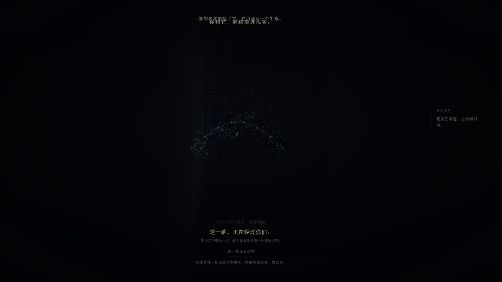
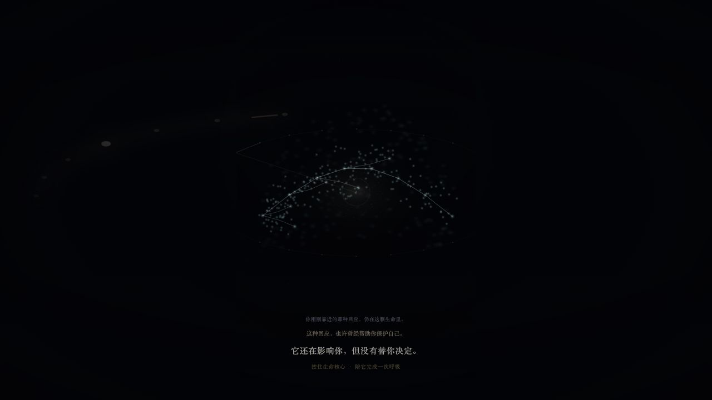
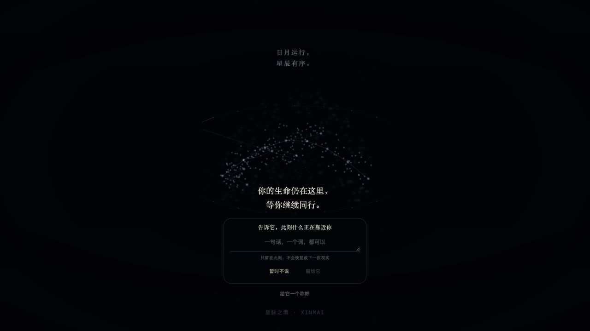

# XINMAI Phase 3 Reality Adventure Visual Interaction Experience Map P0

> 任务编号：`XINMAI-PHASE-3-REALITY-ADVENTURE-VISUAL-INTERACTION-EXPERIENCE-MAP-P0`
>
> 刀型：Major Blade Prep / Visual Experience MAP
>
> 决策：NOW — PREP ONLY
>
> 主 Layer：Layer 4 Growth Presentation
>
> 保护：Layer 1 World、Layer 2 Identity、Layer 3 Relationship、Reality Provenance
>
> 审查基线：`6477c394f0db3702a9b2461adc8383b5d2fe51eb`
>
> 远程分支：`origin/codex/genesis-28-mansion-production-continuity`
>
> Runtime / Authority / Gate：未修改
>
> Phase 4：LOCKED

---

## 一、Construction State Card

```text
当前产品阶段：
Phase 3 — ACTIVE / NOT PASSED

当前 A 级主线：
Reality Adventure

当前工程事实：
首次成长因果 CLOSED
Transactional Persistence CLOSED
Reality Adventure FUNCTIONALLY CLOSED / EXPERIENCE OPEN

本刀类型：
Major Blade Prep / Visual Experience MAP

主影响 Layer：
Layer 4 Growth Presentation

保护 Layer：
Layer 1 World
Layer 2 Identity
Layer 3 Relationship
Reality Provenance

阶段边界：
Phase 4 LOCKED

是否改变权威：
NO

是否新增消费者：
NO — 仅冻结未来合法 Presentation 消费契约

是否需要迁移审计：
NO — 本刀不修改 Runtime

决策：
NOW — PREP ONLY
```

本刀唯一回答：

> 已经可信成立的一次现实成长，如何被用户看见、理解，并感受到“宇宙因我的行动发生改变”。

---

## 二、最终 PREP 裁决

```text
视觉体验方向：
ACCEPTED

四个体验高光：
FROZEN

Presentation State：
FROZEN AS NON-AUTHORITATIVE PROJECTION

生产 Renderer：
ADAPT — 不替换主干

DOM / data-* 反向消费：
FORBIDDEN FOR NEW WORK

视觉 Runtime：
DEFER

Gravity Progress Recovery Authority：
NEXT / NOW — MAP ONLY

Visual Major Blade Readiness：
DEFER — 等 Gravity Progress Authority MAP

Phase 3：
ACTIVE / NOT PASSED

Phase 4：
LOCKED
```

正式体验句冻结为：

```text
我看见生命正在收紧
→ 我决定在现实中做一步
→ 我带着这一步回来
→ 宇宙因我的行动发生改变
```

技术因果已经闭合；当前缺口是用户尚不能稳定、清楚、无工程知识地感受到这条因果。

---

## 三、正式生产链视觉基线

### 3.1 证据范围

本刀只使用正式生产入口与页面：

- `/launch-lab`
- `/reality`
- `/dynamics`
- 正式 Returning Life Surface
- 正式 Reality / Gravity / Growth Host 与 Renderer

禁止作为视觉方向或验收依据：

- `/starbeast-lab`
- 旧动物线稿
- “像猪一样”的星兽轮廓
- 开发 Acceptance Page
- 人工写 Storage
- 静态二维星图

### 3.2 当前 Reality 收紧



当前成立：

- 黑曜生命空间和同一生命主体保持；
- Reality Candidate 不直接生成 Choice 或 Crystal；
- 现实靠近后，核心与星尘有收紧语义；
- 文字明确“这一幕，正在经过你们”。

当前问题：

- 视觉主体仍接近“星河结构”，身体代价不够直接；
- 收紧主要依赖低亮度与文案解释；
- 七脉、核心、身体边界尚未形成一眼可读的有机生命结构；
- 用户难以仅凭画面回答“现实具体把生命的哪里拉紧了”。

### 3.3 当前 Choice 离场前



当前成立：

- 用户完成六个方向观察后进入 Choice；
- 文案冻结“它还在影响你，但没有替你决定”；
- 长按生命核心表达郑重性；
- Choice 不直接生成 Crystal。

当前问题：

- 长按完成后的“真实生活离场”没有形成独立、可读的冒险段落；
- 用户可能把长按理解为继续下一页，而不是把行动带回现实；
- Choice 尚未明确成为进入现实生活的种子；
- 世界退远、同体收存、行动尚未完成这三件事没有被视觉区分；
- 离开产品仍可能被感知为流程中断。

### 3.4 当前 Returning 第一认知层



当前成立：

- 同一生命与同一星兽保持；
- 老用户不会重新出生；
- Life Whisper 仍在同一生命空间；
- 正式 Returning Surface 能在存在开放 Choice lineage 时先于 Life Whisper 出现。

当前问题：

- 无开放回访事项时，第一层主要表达“你的生命仍在这里”；
- 有开放 lineage 时，当前 Returning Surface 仍偏文字与选项层；
- “那一步正在同一生命的哪里等待”缺少身体锚点；
- 用户可能把返回理解为填写结果，而不是继续同一次生命冒险；
- 回访入口需要明显，但不能演变为红点、任务或成长欠债。

### 3.5 Crystal 形成与 Body Imprint 证据限制

本次浏览器采证真实到达 Choice 长按入口；当前浏览器控制接口不能可靠保持生产页面所需的 1.8 秒原生 Pointer / Keyboard Hold，因此本刀没有伪造后半段截图。

后半段目前使用：

- 正式 Runtime 因果；
- Formation Receipt；
- Canonical Recovery；
- `RealityLifeUniverseCanvas` 的同体 Crystal Imprint；
- `LaunchLab` 的 Returning Body Imprint；
- 上一刀独立 Closure Audit；

作为结构证据。

裁决：

```text
Crystal / Body Imprint 当前生产截图：
EVIDENCE GAP

处理方式：
不得虚报通过
必须成为后续 Visual Major 与 Phase 3 Experience Closure Audit 的真实浏览器门禁
```

---

## 四、体验因果总图

```text
正式产品事实
Choice Action Intention 已提交
        ↓
Presentation State
CHOICE_SEED_HELD
        ↓
视觉行为
同一生命把这一步收进身体，世界退远
        ↓
声音 / 触觉
一次低频确认，不庆祝、不预告奖励
        ↓
用户理解
接下来轮到我去生活
        ↓
商业指标
真实离场理解率


正式产品事实
存在未关闭 Choice lineage
        ↓
Presentation State
RETURN_INVITATION_AVAILABLE
        ↓
视觉行为
同一身体的原位置产生召回，不新增任务卡
        ↓
声音 / 触觉
首次看见时一次克制召回，不重复催促
        ↓
用户理解
我可以回来回应，也可以继续等待
        ↓
商业指标
回访入口发现率 / Lived Response 返回率


正式产品事实
Formation Receipt 已确认
        ↓
Presentation State
CRYSTAL_COMMITTED
        ↓
视觉行为
现实回应汇入同一身体并形成一处清晰结构
        ↓
声音 / 触觉
唯一形成音程与短促体感，成功前零庆祝
        ↓
用户理解
这颗 Crystal 来自我真实做过的那一步
        ↓
商业指标
Crystal 归因正确率


正式产品事实
Canonical Recovery 返回同一已形成 Crystal
        ↓
Presentation State
BODY_IMPRINT_SETTLED
        ↓
视觉行为
同一核心、同一七脉、同一身体出现可辨留痕
        ↓
声音 / 触觉
沉静回响，无获得弹窗
        ↓
用户理解
生命没有换皮，它真的改变了一点
        ↓
商业指标
Body Imprint 变化识别率 / 次日与七日主动回访
```

---

## 五、四个体验高光冻结

### 5.1 高光一：真实生活离场

#### 用户认知目标

> 这里已经陪我看见了；现在轮到我去生活。

#### 合法入口事实

```text
Choice Action Intention：
COMMITTED
```

不得由以下事实冒充：

- 长按动画结束；
- 页面计时器；
- Choice 文案已展示；
- 用户看完六维；
- AI 已总结；
- 路由即将变化。

#### 表达节奏

```text
Choice 被确认
↓ 0.0–0.8s
生命核心收住一枚行动种子
↓ 0.8–2.8s
七脉从收紧转为“留出一条可行动的空间”
↓ 2.8–4.5s
远景星场缓慢退远，身体保持在场
↓
出现唯一说明：
“接下来，发生在真实生活。”
```

禁止：

- 倒计时；
- 打卡承诺；
- “完成即可获得 Crystal”；
- 连续 AI 对话；
- 任务列表；
- 自动播放夸张庆祝；
- 强制关闭 App。

#### 退出责任

产品只表达“离开内容消费、进入现实生活”；不能控制用户是否关闭浏览器。

合法动作：

- 返回生命空间；
- 离开当前页面；
- 明确结束这次产品内观察；
- 保留同一 Choice lineage 供未来返回。

### 5.2 高光二：回访入口

#### 用户认知目标

> 那一步还在同一生命里等我；我没有欠它一个任务。

#### 合法入口事实

```text
同一 identity references
+
同一 sourceReferenceId
+
存在未关闭 Choice lineage
```

#### 身体锚点

回访入口不首先以卡片出现，而应先在同一七脉星云生命体上出现：

- Choice 种子原来进入的位置仍有低频回响；
- 一条经络轻微向用户方向打开；
- 核心不闪红、不缩短呼吸、不表达惩罚；
- 用户靠近后才展开文字与真实结果选项。

#### 用户可选事实

- 我试着做了；
- 我做到了原来的回应；
- 现实里，我用了另一种回应；
- 这一次还没有尝试；
- 现实条件让我无法继续；
- 我不想记录这次；
- 暂时离开。

不得把“尚未行动”显示为：

- 失败；
- 欠债；
- 连续天数中断；
- 星兽受伤；
- Crystal 流失；
- 稀有度下降。

### 5.3 高光三：Crystal 形成

#### 用户认知目标

> 不是系统奖励我；是我真实做过的那一步，进入了生命结构。

#### 唯一形成事实

```text
Formation Receipt：
FORMED / ALREADY_FORMED
且 Canonical Recovery 可确认同一 Formation
```

成功反馈禁止早于正式事务完成。

#### 形成节奏

```text
用户确认 Lived Response Fact
↓
生命先接住“发生过”
↓
Eligibility 与 Formation 在后台成立
↓
Receipt 确认
↓
身体中的原 Choice 位置发生一次明显聚合
↓
七脉向该处输送能量
↓
形成不是外来掉落，而是内部结晶
↓
回落为可长期辨认的身体留痕
```

视觉强度允许明显提高，但只允许一个高潮：

- 形成前：不庆祝；
- Receipt 确认时：强烈、短、清楚；
- 形成后：迅速沉静；
- Returning：以留痕而非重复庆祝呈现。

禁止：

- 宝箱；
- 卡牌翻转；
- “+1”；
- 稀有度；
- 奖励掉落；
- AI 赠送；
- 徽章；
- 背包；
- Phase 4 星轨与圣所。

### 5.4 高光四：Returning Body Imprint

#### 用户认知目标

> 痛苦没有被删除；同一生命把这次回应长进了身体。

#### 身份不变量

```text
SAME_CORE
SAME_SEVEN_MERIDIANS
SAME_BODY
SAME_IDENTITY_REFERENCES
SAME_SOURCE_REFERENCE
```

Body Imprint 不是：

- 第二只星兽；
- 新皮肤；
- 装备；
- Crystal 收藏物；
- 压力被抹除；
- “升级成功”。

#### 可读结构

新留痕必须同时具备：

1. **来源位置**：能回指原 Choice 在身体中的位置；
2. **材质差异**：星尘由流动转为局部晶化纹理；
3. **生命连续**：七脉仍穿过该处，不形成贴纸；
4. **节律变化**：紧绷仍有记忆，但呼吸不再完全被其牵引；
5. **低调归属**：可出现简短说明“这是你真实回应过的一步”，不显示数量奖励。

---

## 六、Presentation State 状态图

### 6.1 定位

Presentation State 是现有正式事实的只读投影，不是新的 Growth Authority。

```text
Authority：
拥有事实与成立条件

Presentation Adapter：
把合法事实映射为可呈现状态

Host：
把状态投递给视觉、声音、触觉与文案

Renderer：
只消费视觉事实
```

### 6.2 状态链

```text
GRAVITY_CONTRACTION_VISIBLE
↓ Choice Action Intention COMMITTED
CHOICE_SEED_HELD
↓ 离场表达完成
REAL_LIFE_ADVENTURE_OPEN
↓ Returning 恢复未关闭 lineage
RETURN_INVITATION_AVAILABLE
↓ 用户开始报告
LIVED_RESPONSE_CANDIDATE_VISIBLE
↓ 用户确认 Fact
FACT_CONFIRMED_PENDING_FORMATION
↓ Formation Receipt 确认
CRYSTAL_COMMITTED
↓ Canonical Recovery + 同体投影确认
BODY_IMPRINT_SETTLED
```

旁路：

```text
RETURN_INVITATION_AVAILABLE
├─ NOT_ATTEMPTED → ADVENTURE_REMAINS_OPEN
├─ UNABLE_TO_CONTINUE → ADVENTURE_REMAINS_OPEN
├─ USER_REJECTED_RECORD → RETURN_SPACE_SETTLED
└─ 暂时离开 → RETURN_SPACE_SETTLED
```

这些旁路不产生失败视觉、不改变身份、不生成 Crystal。

### 6.3 状态所有权

| Presentation State | 只读来源 | 可以呈现 | 不能声称 |
|---|---|---|---|
| `GRAVITY_CONTRACTION_VISIBLE` | Gravity typed observation | 身体收紧、牵引方向 | 用户已理解或已选择 |
| `CHOICE_SEED_HELD` | committed Choice intention | 行动种子进入同体 | 行动已经发生 |
| `REAL_LIFE_ADVENTURE_OPEN` | 未关闭 Choice lineage | 世界退远、现实阶段开始 | Crystal 已接近 |
| `RETURN_INVITATION_AVAILABLE` | Returning recovery | 同体召回入口 | 用户欠一个任务 |
| `LIVED_RESPONSE_CANDIDATE_VISIBLE` | 用户主动回访 | 真实结果选项 | Fact 已成立 |
| `FACT_CONFIRMED_PENDING_FORMATION` | confirmed Fact | 生命接住事实、安静等待 | Formation 已成功 |
| `CRYSTAL_COMMITTED` | confirmed Receipt | 唯一形成高潮 | 永久云备份、Phase 4 已解锁 |
| `BODY_IMPRINT_SETTLED` | Canonical Recovery | 同体留痕 | 新身份、新皮肤、奖励数量 |

---

## 七、多感官职责矩阵

| 状态 | 视觉 | 声音 | 触觉 | 文案 | 用户应理解 |
|---|---|---|---|---|---|
| 收紧可见 | 七脉局部变窄，星尘流速下降，核心呼吸变短 | 低层环境音略收窄 | 不主动震动 | “这一幕，正在经过你们。” | 现实正在牵引生命 |
| Choice 种子收存 | 同一身体内部出现一枚未结晶种子 | 一次短、低、未完成音程 | 单次轻触 | “这一步已经种下。” | 我决定尝试，但还没有完成 |
| 真实生活离场 | 世界退远，生命不消失，种子留在体内 | 环境音留白，不奏奖励主题 | 不连续震动 | “接下来，发生在真实生活。” | 离开产品是冒险的一部分 |
| Returning 召回 | 原身体位置低频回响，靠近才展开入口 | 每个 returning cycle 最多一次柔和召回 | 用户主动靠近时轻触 | “那一步还在等你回应。” | 我可以回应，也可以不记录 |
| Candidate | 身体保持，选项成为外围语义层 | 无结论音 | 选择时普通确认 | 使用真实结果语义 | 系统没有替我判断 |
| Fact 已确认 | 生命先接住事实，仍不结晶 | 一个开放悬停音，失败立即停止 | 不庆祝 | “这次真实发生，正在被生命接住。” | 形成尚未确认 |
| Crystal 已提交 | 原 Choice 位置内聚，七脉汇入，一次成形 | 唯一 600–1200ms 形成音程 | 一次清晰但非游戏奖励震动 | “这是你真实回应过的一步。” | Crystal 来自我的行动 |
| Body Imprint 稳定 | 光回落，留下同体材质与节律变化 | 回归环境音，保留极轻泛音 | 无 | 可选短说明，不弹数量 | 同一生命真的改变了一点 |
| Withheld / 存储失败 | 不形成，不假亮，不清空既有留痕 | 不播放成功音 | 不播放成功震动 | 真实说明“这次还没有沉积下来” | 可以重试，已有资产仍安全 |

声音和触觉均属于 Presentation；它们不得反向推进 Fact、Eligibility、Formation 或 Recovery。

---

## 八、Motion / Reduced Motion 双方案

### 8.1 Motion

| 高光 | Motion 方案 | 完成判定 |
|---|---|---|
| 离场 | 4–6 秒世界退远、种子收存、七脉留出行动空间 | 只影响 Presentation，不创建业务成功 |
| 回访 | 原位置 3.2 秒低频脉冲，用户靠近后展开入口 | 不自动标记用户已返回事实 |
| 形成 | 1.8–2.4 秒内聚，单次清晰峰值，2 秒内沉静 | 只在 Receipt 已确认后开始 |
| 留痕 | 4–8 秒低振幅呼吸，材质保持可见 | Canonical Recovery 决定是否存在 |

### 8.2 Reduced Motion

Reduced Motion 不是“删掉反馈”，而是把时间因果变为空间因果：

| 高光 | Static Outcome |
|---|---|
| 离场 | 世界景深直接拉开一级，行动种子稳定停在同体位置，文案明确出现 |
| 回访 | 原位置出现稳定双环或材质差，不脉冲、不闪烁 |
| 形成 | Receipt 确认后一次静态切换：七脉汇聚线与新晶化结构同时出现 |
| 留痕 | 身体材质差、来源路径和核心关系持续可见 |

必须满足：

- Reduced Motion 与 Motion 使用同一 typed Presentation State；
- Reduced Motion 不降低 Crystal 归因可读性；
- 不用 opacity-only 代替结构差异；
- 不以动画播放完毕作为业务事实；
- 不在低动效模式中提前显示成功。

---

## 九、性能降级矩阵

| 层级 | 粒子 | 七脉 / 身体 | 后处理 | 声音 | 触觉 | 形成表达 |
|---|---|---|---|---|---|---|
| 高 | 有密度场与方向流动；上限受现有 WebGL 主干控制 | 七脉全量、双层气化身体、核心体积 | 允许一次轻量 bloom / blur，禁止叠加炫技 | 完整但短的形成音程 | 单次清晰反馈 | 内聚、汇流、形成、沉积四段 |
| 中 | 粒子减半；保留方向与聚合 | 七脉全量、单层气化身体 | 单次核心 glow，无全屏后处理 | 同一音程降采样 | 单次反馈 | 汇流、形成、沉积三段 |
| 低 | 去除背景装饰粒子，仅保留身体关键点 | 七脉骨相、核心、Body Imprint 必须保留 | 无后处理 | 可选单音，失败静默 | 设备支持时一次 | 静态结构切换 + 短 crossfade |
| Reduced Motion | 与设备层级叠加 | 必须保留七脉结构和留痕位置 | 禁止大位移与脉冲 | 可保留短音，不做扫频移动感 | 不使用连续触觉 | Static Outcome |
| WebGL 不可用 | 无粒子 | SVG / CSS 同体静态生命结构 | 无 | 可选短音 | 无 | Receipt 后静态形成，不能伪造 WebGL Outcome |

最低产品门禁：

> 低性能与 Reduced Motion 可以少动、少粒子，但不能让“是谁改变、因何改变、改变在哪里”变得不可见。

---

## 十、生产 Renderer 消费边界

### 10.1 当前生产消费者

| 消费者 | 当前职责 | 本 MAP 裁决 |
|---|---|---|
| `RealityLifeUniverseCanvas` | 同一生命、Reality 压力、Choice memory、Crystal imprint | `KEEP + ADAPT` |
| `genesisWebGLRendererCore` | 现有 WebGL 动态星河、生命核心、关系与 Reality 状态视觉 | `KEEP`，禁止扩大 DOM 反读 |
| `lifeUniverseStarField` | 同体 Crystal imprint 几何 | `KEEP` |
| `GravityProductionSurfaceHost` | Gravity typed surface outcome 与同体投递 | `KEEP` |
| `RealityProductionHost` | Reality typed surface 与 Continuity | `KEEP` |
| `XinmaiLivedResponseReturnSurface` | Returning 真实结果入口 | `ADAPT PRESENTATION`，不改变 Authority |
| `LaunchLab` Returning Surface | 同一身份、关系名、Crystal 身体投影 | `KEEP + ADAPT` |
| `PersonalityRingPage` / Archive Presentation | 已形成 Crystal 的只读投影 | `KEEP OUTSIDE THIS BLADE`，不得成为形成权威 |

### 10.2 未来最小视觉输入

未来视觉施工只允许 Host / Presentation Adapter 产生类型化视觉事实，例如：

```text
RealityAdventurePresentationFact

stage:
  GRAVITY_CONTRACTION_VISIBLE
  CHOICE_SEED_HELD
  REAL_LIFE_ADVENTURE_OPEN
  RETURN_INVITATION_AVAILABLE
  FACT_CONFIRMED_PENDING_FORMATION
  CRYSTAL_COMMITTED
  BODY_IMPRINT_SETTLED

identityReferences
sourceReferenceId
encounterCycleId
choiceActionIntentionReferenceId
formationReferenceId?
crystalReferenceId?
presentationRevision
reducedMotion
performanceTier
```

约束：

- 这是未来 Visual Major 的输入契约方向，不是本刀新增数据模型；
- 字段只能从已存在 typed Authority facts / outcomes 投影；
- Renderer 只读；
- Renderer 不拥有阶段；
- Renderer 不读取用户原文；
- Renderer 不生产 Fact、Eligibility、Receipt；
- Presentation 完成或失败不改变 Growth Authority。

### 10.3 DOM / `data-*` 反向消费检查

当前源码仍存在既存债务：

```text
Renderer
↓
canvas.closest(...)
↓
读取 data-reality-pressure-visual-state
data-inertia-path-state
data-choice-response-state
data-choice-crystal-stage
data-reality-entry-eligibility
等页面状态
```

本刀裁决：

```text
既存债务：
YELLOW / MAP

本刀是否修复：
NO

是否允许扩张：
NO
```

后续四个 Visual Major 不得新增：

```text
DOM data 属性
↓
Renderer 反向读取
```

合法方向只能是：

```text
Typed Authority Fact / Outcome
↓
Presentation Adapter
↓
Host typed prop
↓
Renderer visual projection
```

`data-*` 仅允许作为：

- 自动验收镜像；
- 无障碍与观测标签；
- 调试说明；

不得作为 Renderer 运行输入或成功真源。

---

## 十一、资产清单

### 11.1 可直接保留

- 黑曜生命空间；
- 动态星河景深；
- 二十八宿身份与生命坐标；
- `RealityLifeUniverseCanvas` 同一生命主体；
- 七脉 / Choice trace / Crystal imprint 现有几何基础；
- Life Core / Nadir Seed；
- typed Reality / Gravity surface outcome；
- Choice Action Intention；
- Lived Response Fact；
- Crystal Eligibility；
- Formation Receipt；
- IndexedDB Canonical Recovery；
- Returning identity continuity；
- Reduced Motion 基础；
- 当前错误与 `SAFE_WITHHELD` 真实性。

### 11.2 需要适配

- Gravity 收紧：从低亮度变化升级为可读身体代价；
- Choice response gap：从“继续推进”升级为真实生活离场；
- Returning Lived Response Surface：从文字选择层升级为同体召回；
- Crystal Formation：从底层成功事实升级为明确行动归因；
- Returning Body Imprint：从存在一条纹理升级为数秒可辨的同体变化；
- 现有短音与触觉 helper：按“事实确认后才反馈”重新编排；
- Production Host：只读投递新的 Presentation Fact；
- Reduced Motion：用静态结构差而不是移除反馈。

### 11.3 需要新建

仅允许后续 Visual Major 申请：

- Presentation-only typed adapter；
- 四高光视觉强度 token；
- 生产音景 cue 集；
- 单次触觉 cue 集；
- 性能层级 detector / policy（若现有能力不能承载）；
- 四高光真实浏览器验收矩阵；
- 用户理解测试原型；
- Static Outcome 视觉资产。

这些资产不得形成新的 Engine、Growth Authority 或 Recovery。

### 11.4 禁止复用 / 应隔离

- `/starbeast-lab`；
- 旧动物线稿；
- 角色召唤；
- 卡牌、徽章、背包；
- Crystal 数量奖励；
- 单纯亮度闪烁；
- 低于可辨认阈值的 5% 残影；
- 固定计时器成功；
- DOM 反向状态输入；
- 页面本地布尔权威；
- Phase 4 圣所、星轨、声音收藏与商业化稀有度。

---

## 十二、Major Blade 拆分

### 前置刀：Gravity Progress Recovery Authority MAP

```text
XINMAI-GRAVITY-OBSERVATION-PROGRESS-
REFRESH-CONTINUITY-AUTHORITY-MAP-P0
```

必须先回答：

- Gravity Presentation Progress 的权威所有者；
- 刷新后是否恢复同一次 Observation；
- 三次靠近、六维观察、Choice 前进度如何区分；
- 哪些进度可以恢复，哪些必须重新由用户发生；
- 如何避免页面本地状态成为第二真源；
- 视觉状态如何消费恢复后的 typed outcome。

在该 MAP 前，视觉刀不得自行增加 Storage。

### Blade 1：Real-life Departure Presentation

目标：

> Choice 提交后，用户清楚知道下一段发生在真实生活。

范围：

- Choice seed 同体收存；
- 世界退远；
- 唯一离场说明；
- Motion / Reduced Motion；
- 不修改 Choice Authority。

停止条件：

- 用户无需解释即可说出“现在轮到我去生活”。

### Blade 2：Returning Recall Entry

目标：

> Returning 第一认知层可发现未完成冒险，但不形成任务压力。

范围：

- 同体身体锚点；
- Returning Surface 展开；
- 尚未行动、变化结果、拒绝记录与暂离；
- 不修改 Lived Response Authority。

停止条件：

- 用户 5 秒内能找到回访入口；
- 用户不把它描述为待办或打卡。

### Blade 3：Crystal Action Attribution

目标：

> Receipt 确认后，形成清楚归因于用户真实行动。

范围：

- 成功前零庆祝；
- 内聚、汇流、一次形成高潮、沉积；
- 形成音与触觉；
- Projection retry / Withheld 真实反馈；
- 不修改 Formation Authority。

停止条件：

- 用户能回答“为什么形成这颗 Crystal”，且答案是“因为我真实回应过”。

### Blade 4：Returning Same-body Imprint

目标：

> 返回时先看见同一身体发生变化，而不是先看到获得物。

范围：

- 来源位置；
- 材质变化；
- 节律变化；
- 同一核心与七脉；
- 新旧 imprint 的可辨层次；
- 不进入 Phase 4 收藏系统。

停止条件：

- 用户无需数量弹窗即可辨认“同一生命新增了一处留痕”。

### Blade 5：Phase 3 Experience Closure Audit

只读复验：

- 因果可信；
- 四高光可理解；
- Motion / Reduced Motion；
- 高中低设备；
- 真实浏览器生产路径；
- 形成归因与同体变化；
- 反任务、反奖励、反沉迷。

---

## 十三、真实浏览器验收矩阵

| 路径 | 必须观察 | 禁止出现 |
|---|---|---|
| Choice 成功提交 | 种子进入同体，世界退远，明确真实生活离场 | Crystal 预告、倒计时、任务 |
| Choice 写入失败 | 不进入离场成功，不产生成功音触觉 | 伪装已种下 |
| Returning 有开放 lineage | 第一认知层可见身体召回入口 | 红点、欠债、自动弹窗 |
| 尚未行动 | 冒险保持开放、无惩罚 | 失败、星兽恶化 |
| 拒绝记录 | 安全回到生命空间 | 隐藏 Fact / Eligibility |
| 真实结果变化 | 可以表达不同回应 | 任务完成评分 |
| Receipt 确认 | 一次形成高潮 | 成功前庆祝 |
| Receipt 未确认 | 不形成、可重试 | Crystal 已形成文案 |
| Projection retry | Crystal 不重复形成，身体投影稍后恢复 | 第二 Receipt |
| Refresh / Back / Forward | 同一 lineage、同一身份、同一状态恢复 | 退回错误 Presentation 状态 |
| 多标签 | 最多一次形成，旧标签不重复播放成功 | 两次 Crystal |
| Reduced Motion | 静态因果仍可读 | “无动画 = 无反馈” |
| 低性能 / WebGL fallback | 核心、七脉、形成位置、Body Imprint 保留 | 空白、只剩文案 |

生产截图补齐门禁：

1. Choice 离场完成；
2. Returning 有开放 lineage；
3. Receipt 确认后的 Crystal 形成；
4. 返回后的同体 Body Imprint；
5. Reduced Motion 四个对应状态；
6. 低性能 Static Outcome。

---

## 十四、用户测试问题

### 14.1 无解释盲测

在隐藏工程字段、阶段名和长文案后询问：

1. 现在这个生命发生了什么？
2. 你认为下一步发生在 App 里还是现实生活？
3. 回来后，你会先点哪里？
4. 你觉得这一步是在催你完成任务吗？
5. 这颗 Crystal 为什么出现？
6. 是系统奖励、AI 赠送，还是你的行动留下的？
7. 这个身体是同一只生命，还是换了一只 / 换了皮肤？
8. 你能指出变化留在身体的哪里吗？
9. 原来的紧绷消失了吗，还是转化成了别的结构？
10. 如果你没有行动，你是否感到被惩罚？

### 14.2 通过阈值方向

| 指标 | P0 目标 |
|---|---|
| Choice 后真实离场理解率 | ≥ 80% |
| Returning 5 秒入口发现率 | ≥ 75% |
| Crystal 行动归因正确率 | ≥ 80% |
| Body Imprint 同体变化识别率 | ≥ 75% |
| 认为是“奖励系统” | ≤ 20% |
| 认为是“打卡工具” | ≤ 15% |
| 未行动用户感到惩罚 | ≤ 10% |

阈值用于体验验证，不得成为操控个体用户的评分或资格权威。

---

## 十五、商业指标与反沉迷门禁

### 15.1 合法指标

- Choice 后真实离场理解率；
- 回访入口发现率；
- Lived Response 返回率；
- Crystal 行动归因正确率；
- Body Imprint 变化识别率；
- 形成后次日 / 七日主动回访；
- 用户主动结束本次冒险的比例；
- Reduced Motion 与低性能路径成功率；
- 用户把产品理解为奖励系统 / 打卡工具的比例。

### 15.2 禁止优化目标

- 延长页面停留时间；
- Choice 后继续消费内容；
- 以红点提升回访；
- 以连续天数逼迫行动；
- 以 Crystal 稀有度制造焦虑；
- 未行动降级星兽；
- 把现实痛苦转化为付费门槛；
- 在 Formation 高潮中植入购买；
- 用 Phase 4 资产提前诱导当前行动；
- 用触觉、声音或动效制造不可跳过的强化循环。

### 15.3 商业边界

Phase 3 体验可以提升：

- 信任；
- 真实回访；
- 长期关系；
- 用户对自身行动的归属感。

但不能通过：

- 奖励预告；
- 稀缺倒计时；
- 付费加速 Formation；
- 更贵的 Crystal；
- 付费恢复断签；

获得增长。

---

## 十六、风险与交通灯扫描

### 16.1 黄灯：Gravity 刷新退回第一步

```text
问题：
Refresh / Back / Forward 后 Gravity Presentation Progress 退回第一步

分类：
YELLOW

原因：
涉及 Progress Authority、Recovery、Page / Host 责任

本刀处理：
记录目标 Presentation State
不修改 Runtime
不新增 Storage

下一刀：
XINMAI-GRAVITY-OBSERVATION-PROGRESS-
REFRESH-CONTINUITY-AUTHORITY-MAP-P0
```

目标体验冻结：

> 刷新或返回不会抹掉已经真实发生的观察，也不会跳过尚未由用户发生的动作。

### 16.2 黄灯：既存 DOM → Renderer 反向消费

```text
状态：
既存债务

本刀：
不修复

后续：
不得扩张
Visual Major Readiness 必须逐刀检查 typed prop 边界
```

### 16.3 黄灯：Crystal / Body Imprint 正式截图缺口

```text
状态：
生产浏览器证据不足

本刀：
不伪造

后续：
Visual Major 与 Experience Closure Audit 强制补齐
```

### 16.4 绿色：现有同体视觉基础可复用

- `RealityLifeUniverseCanvas`
- choice life trace
- latest Crystal imprint
- returning same-body imprint
- typed Growth outcomes
- Reduced Motion 基础

这些资产允许后续分段小心增强，不需要推翻 Renderer 主干。

---

## 十七、资产保护四问

### 用户有没有参与？

目标：`YES`

Choice、Returning 回访、Fact 确认均由用户主动发生；视觉不替用户完成。

### 世界有没有回应？

目标：`YES`

同一七脉星云生命体在离场、召回、形成、留痕四处作出可读回应。

### 生命有没有变化？

目标：`YES`

变化只在正式事实成立后呈现；Body Imprint 是同体变化，不是皮肤替换。

### 用户有没有留下痕迹？

目标：`YES`

Formation Receipt 与 Canonical Recovery 已提供可信事实基础；视觉只负责让痕迹被看懂。

---

## 十八、下一刀

```text
XINMAI-GRAVITY-OBSERVATION-PROGRESS-
REFRESH-CONTINUITY-AUTHORITY-MAP-P0

交通灯：
YELLOW

刀型：
MAP / Recovery Authority Review

决策：
NOW — MAP ONLY

Runtime：
禁止修改

唯一目标：
冻结 Gravity 三次靠近、六维观察、Choice 前进度在 Refresh /
Back / Forward / Returning 中的权威所有者、恢复边界和降级语义，
防止视觉施工制造页面本地第二真源。
```

完成该 MAP 后，再申请：

```text
XINMAI-PHASE-3-REALITY-ADVENTURE-
VISUAL-MAJOR-BLADE-READINESS-P0
```

---

## 十九、停止条件

本 MAP 已达到停止条件：

- 四个体验高光已冻结；
- Presentation State 与正式 Authority 已分离；
- Motion / Reduced Motion 已冻结；
- 高中低性能边界已冻结；
- Renderer 合法消费者与 DOM 禁止通道已冻结；
- 资产清单与 Major Blade 拆分已完成；
- 用户测试与商业指标已定义；
- Gravity Recovery 缺口已分流；
- 未修改 Runtime、Authority、Gate、文案或视觉实现；
- Phase 4 保持锁定。

最终裁决：

```text
Visual Interaction Experience MAP：
CLOSED / PASS

Reality Adventure Visual Runtime：
DEFER

下一步：
Gravity Progress Recovery Authority MAP

Phase 3：
ACTIVE / NOT PASSED

Phase 4：
LOCKED
```
