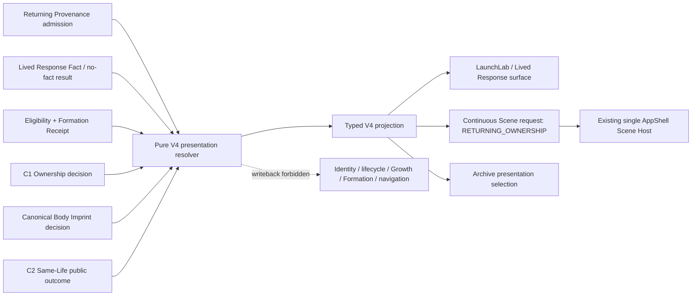

# XINMAI Phase 3 Returning / C1 / C2 Same-Life Continuity Integration MAP / PREP P0

```text
Traffic light: YELLOW
Blade: Product / Visual Experience Architecture MAP + Major Blade Prep
Decision: MAP / PREP ONLY
Runtime / Renderer / CSS / Gate / Authority / Storage / Schema / Copy / Assets: 0 changes
Push: HOLD until exact document delivery
```

## 0. Baseline and scope

This document is based on the production continuity branch at:

```text
Remote / Parent:
ed4f94b75a157f04d56cea257a664fc88c4f8f92

V3 Reality / Gravity / Choice Runtime Authority:
CLOSED / Delivery CLOSED

C1 Formation / Ownership:
CLOSED / PASS

C2 Canonical Body Imprint / Single Presenter:
CLOSED / PASS
```

V4 does not reopen C1, C2, or V3. It freezes the presentation-only integration from Explicit Departure and Explicit Return through Lived Response, Formation, Ownership, Same-Life Body Imprint, and Archive. It does not change the product authorities that produce those facts.

The governing principle remains:

> Make the protection, benefit, and cost of a choice visible; let the user decide in reality what to take up and what to put down; the system does not judge, and only real action forms a growth trace.

## 1. What is closed and what remains open

### 1.1 Functionally closed

- Explicit Departure is the only product event that closes the active Gravity lifecycle and releases its active identity key through the existing reconciliation saga.
- Explicit Return creates or recovers one `CHOICE_RETURN` target and one Return Receipt through the existing typed authorities.
- `ATTEMPTED` and `CHANGED_RESPONSE` can form a confirmed Lived Response Fact; `NOT_ATTEMPTED` and `USER_REJECTED_RECORD` intentionally form no Fact, Eligibility, Crystal, or Body Imprint.
- Formation success is authoritative only after `IDB_TRANSACTION_COMPLETE`.
- C1 Ownership distinguishes `CURRENT_TRANSACTION` from `CANONICAL_RECOVERY`; recovered ownership does not replay first-formation success.
- C2 projects a stable Body Reference and stable Imprint nodes from canonical facts and commits exactly one Motion or Static body presenter.
- Reality, Gravity, Returning, and Archive already consume the same C2 public outcome family.
- V1 provides one AppShell-level Continuous Scene Host; V3 provides one read-only semantic projection for Reality / Gravity / Choice.

### 1.2 Experience still open

The following facts are not yet bound by one V4 presentation contract:

- the six public checkpoint states and the Continuous Scene `RETURNING_OWNERSHIP` request;
- Formation pending versus Ownership available in FAR / MID / NEAR composition;
- the current Crystal / Imprint / stable node reference used by the Ownership surface and Archive;
- the no-fact terminal branch and the absence of a Crystal target;
- recovery silence across checkpoint, Ownership, Same-Life Accessible Mirror, and Scene semantics;
- atomic alignment of LaunchLab, the Lived Response surface, C1 Ownership, C2 Same-Life presentation, and Archive.

This is a presentation-consumer gap, not an Authority gap.

## 2. Current producer / consumer matrix

| Product fact | Formal producer / owner | Typed output | Current production consumers | V4 rule |
| --- | --- | --- | --- | --- |
| Choice intention | existing Choice controller / transaction authority | `ChoiceActionIntention` | Gravity, Returning provenance | read only; never re-derived by V4 |
| Departure | Growth transaction authority plus Reality lifecycle reconciliation owner | Departure Receipt + reconciliation proof | Returning admission, Reality lifecycle recovery | read only; scene cannot complete departure |
| Return | Returning provenance controller plus Reality intent authority | Return Receipt + one target cycle | Lived Response surface, Recovery | read only; scene cannot create a return |
| Lived response | Lived Response Authority Controller | `LivedResponseFact` or no-fact resolution | Eligibility, Returning admission | no-fact remains an intentional terminal outcome |
| Eligibility | Crystal Eligibility Authority | `CrystalEligibility` | Formation consumer, checkpoint resolver | never inferred from UI state |
| Formation | Formation consumer / production orchestrator | `CrystalFormationReceipt` | C1 Ownership, checkpoint resolver, canonical projector | success only after IDB transaction completion |
| Ownership | Crystal Ownership Presentation Resolver | pending / confirmed / presented / recovered / withheld | Ownership moment, checkpoint resolver | presentation only; recovery does not replay |
| Canonical Body Imprint | Canonical Body Imprint Projector + recovery adapter | `XinmaiCanonicalBodyImprintDecision` | C2 facts, checkpoint resolver, Archive | the only Body / Imprint source |
| Same-Life surface | C2 Same-Life Host Resolver + trusted presenter proof | Motion / Static / Safe-Withheld public outcome | Reality, Gravity, Returning, Archive, accessible mirror | one body presenter; V4 only consumes |
| Continuous Scene | AppShell Host + scene resolver + presenter proof | Motion / Static / Safe-Withheld scene outcome | route-level visual consumers | one host; V4 publishes typed facts only |
| Checkpoint | pure checkpoint resolver | six public states | LaunchLab and Lived Response surface | current presentation truth for departure / return / formation / ownership |

No current producer grants V4 permission to write Identity, lifecycle, Growth, Formation, Crystal, Body Imprint, navigation, or Storage.

## 3. Existing six-state contract

The existing public state union remains authoritative for checkpoint presentation:

| State | Minimum current typed facts | What may be shown | What must not be shown |
| --- | --- | --- | --- |
| `BASELINE_LIFE_WORLD` | no active return confirmation, or committed Choice awaiting Departure, or Departure awaiting explicit Return | the life world and the next native control permitted by current admission | a Fact, Crystal, Ownership, or completed real action |
| `RETURN_ACCEPTED_AWAITING_RESPONSE` | current typed Return acceptance, before the response surface is fully ready | return has been accepted and the response is being prepared | Formation, Ownership, or a replayed return success |
| `READY_TO_CONFIRM_REAL_RESPONSE` | current Return Receipt and one valid target cycle | four response choices and the distinction between fact-forming and no-fact branches | any Fact, Eligibility, Crystal, or growth claim before user confirmation |
| `FORMATION_IN_PROGRESS` | confirmed Fact + current Eligibility / formation request, no receipt yet | real response saved; formation is not yet complete | a visible Crystal, Ownership, Imprint, or scene success based on animation |
| `OWNERSHIP_PRESENTED` | canonical receipt + matching C1 ownership decision; Body Imprint claim only when canonical decision supports it | current or recovered Crystal, same-life body and stable node, continue action | duplicate assets, a new formation replay on recovery, or navigation before user action |
| `SAFE_WITHHELD` | identity / lineage / recovery / formation / policy proof not trustworthy | restrained explanation; preserved assets; only a legal retry action when the underlying authority permits it | stale asset substitution, old page-local success, or inferred ownership |

V4 does not add a seventh state. It maps these six states into the existing Continuous Scene presentation model.

## 4. V4 single-direction presentation contract

### 4.1 Recommended read-only projection

V4 requires one pure typed projection between checkpoint / ownership facts and the existing Continuous Scene request. A mechanically suitable name is:

```text
XinmaiReturningSameLifeContinuityPresentation
```

It is a presentation decision, not a state machine and not a second owner.



The dashed edge is forbidden.

### 4.2 Minimum input

The input must contain stable typed facts only:

- current identity status and source / render-plan / identity references;
- current Returning provenance admission and its immutable lineage references;
- current Fact and no-fact resolution outcome;
- current Eligibility and Formation Receipt;
- current C1 Ownership decision and `presentationOrigin`;
- current Canonical Body Imprint decision;
- current C2 Same-Life selection and committed public outcome;
- native Motion preference;
- current checkpoint decision.

It must not contain:

- DOM attachment or CSS state;
- `data-*` observations;
- timer, RAF, animation-complete, frame count, or console state;
- page-local success booleans;
- raw Storage records read by a page;
- a camera frame, particle position, or animation progress;
- unconfirmed user text as an identity asset.

### 4.3 Minimum output

The output may contain:

- current checkpoint state and stable projection reference;
- current source / Choice / Departure / Return / Fact / Eligibility / Formation references when present;
- current Crystal / Body / Imprint / stable node references when canonical;
- FAR / MID / NEAR presentation instruction;
- current near object kind and reference;
- `CURRENT_TRANSACTION` or `CANONICAL_RECOVERY` presentation origin;
- `ANNOUNCE_ONCE` or `RECOVERY_SILENT` semantic policy;
- `PRESENTABLE` or `SAFE_WITHHELD` with a typed reason;
- `authorityWriteback: FORBIDDEN`.

It may not declare that an action occurred, form a Crystal, consume a receipt, change admission, or navigate.

## 5. Six states mapped to the same world

| Checkpoint | FAR | MID | NEAR | Required reference behavior |
| --- | --- | --- | --- | --- |
| baseline | same environment topology; no completion flourish | existing same-life body when C2 proof is available | no ownership object; only the native next-step control | canonical historical Imprints may remain settled; no current-formation salience |
| return accepted | environment remains continuous and restrained | same body / same source | one non-interactive return focus; no Crystal | Return / source / target lineage must match |
| ready to confirm | no scene reset | same body remains | native response controls are the only actionable NEAR objects | response options remain DOM controls; scene has no hit owner |
| formation in progress | no celebratory expansion | same body unchanged | no Crystal object; optional non-interactive pending locus only | Fact + Eligibility references current; Receipt absent |
| ownership presented | same world, no new opening sequence | same C2 body and canonical Imprint set | exactly one current Crystal at the canonical stable node; native Crystal button remains the real hit target | Receipt, Crystal, Body, Imprint, stable node and C2 proof all match |
| safe withheld | no false world success | C2 public surface may remain independently available if its proof is valid | no new V4 object or hit target | existing canonical assets remain readable; V4 projection withheld |

Reduced Motion uses the same facts, composition, object identity, and accessible semantics. Only the movement implementation changes. A Static scene may not have WebGL or RAF.

## 6. Fact-forming and no-fact branches

### 6.1 Fact-forming branch

`ATTEMPTED` and `CHANGED_RESPONSE` remain the only positive response categories. V4 accepts a current Fact only after the existing confirmation transaction completes.

```text
READY_TO_CONFIRM_REAL_RESPONSE
→ user confirms ATTEMPTED or CHANGED_RESPONSE
→ Fact transaction complete
→ Eligibility authority result
→ Formation request / recovery
→ Formation Receipt transaction complete
→ C1 Ownership decision
→ Canonical Body Imprint projection
→ C2 committed surface proof
→ V4 OWNERSHIP projection
```

V4 must withhold if any reference in this chain mismatches. It may not skip ahead because a Crystal graphic is visible.

### 6.2 No-fact branch

`NOT_ATTEMPTED` and `USER_REJECTED_RECORD` are legitimate user choices. They produce no Fact, Eligibility, Crystal, Formation Receipt, or Body Imprint.

The existing lifecycle owner terminates the target and releases its key. V4 must then return to a truthful baseline or typed pending / withheld state. It must not:

- create an empty ownership surface;
- mark a Crystal as missed;
- imply failure, punishment, or loss;
- leave `CRYSTAL_OWNERSHIP` as the current NEAR object;
- navigate to Reality before target termination is legally complete.

## 7. Ownership and recovery

### 7.1 Current transaction

For a new formation:

- the Receipt is the success authority only after IDB transaction completion;
- the first Ownership announcement is keyed by the stable Formation reference;
- the visible Crystal and C2 Imprint use the exact receipt / projector references;
- the native Crystal button is the only Crystal hit target;
- the Continue button alone exits the evidence surface.

### 7.2 Canonical recovery

For recovered ownership:

- `presentationOrigin = CANONICAL_RECOVERY`;
- C1 state is `RECOVERED_EXISTING`;
- checkpoint state remains `OWNERSHIP_PRESENTED`;
- announcement is null / `RECOVERY_SILENT`;
- the same Receipt, Crystal, Body, Imprint, and stable node references are restored;
- no Formation animation, audio, haptic, celebration, or first-time status is replayed;
- no additional Receipt, Crystal, or Imprint is written.

Recovery silence must be shared by the checkpoint live region and the Same-Life Accessible Semantic Mirror. Two separate live regions must not announce the same transition.

## 8. Consumer cutover matrix

| Consumer | Current role | V4 change required | Must remain unchanged |
| --- | --- | --- | --- |
| `LaunchLab` | recovers Identity, canonical Imprint, Returning admissions; hosts Returning route surface | build one V4 typed input and publish its projection | Recovery adapters, navigation authority, Genesis / V2 behavior |
| `XinmaiLivedResponseReturnSurface` | performs existing user actions and renders six checkpoint states | consume the same V4 projection for state-to-scene alignment and announcement ownership | all mutation controllers and form controls |
| `XinmaiCrystalFormationOwnershipMoment` | C1 Ownership visual and native Crystal / Continue controls | consume matching stable refs / presentation origin; remain the only Ownership control surface | C1 state / copy / success authority |
| `RealityLifeUniverseCanvas` | C2 presenter adapter and Continuous Scene publisher for four consumers | replace heuristic Returning / Archive near-object selection with the V4 projection | renderer, C2 proof, single Host registration |
| `XinmaiContinuousScenePresentationResolver` | validates scene input and composes FAR / MID / NEAR | accept one V4 projection type for `RETURNING_OWNERSHIP` / `ARCHIVE` without weakening proof | public scene outcome and proof requirements |
| `PersonalityRingPage` | Archive recovery and C2 mirror | publish Archive projection from the same canonical refs; never create current Ownership | archive navigation and legacy history isolation |
| Same-Life Accessible Mirror | exposes canonical body / imprint semantics | receive recovery-silent state ownership without duplicate announcement | C2 outcome validation and canonical matching |
| Gates | protect C1, C2, V1, checkpoint, and V3 boundaries | register V4 purity, lineage, consumer alignment, no-fact, recovery-silent, and counter checks | all existing gates and aliases |

Reality and Gravity do not become new V4 owners. They continue to consume the same C2 Body / Imprint facts; V4 verifies their references against Returning and Archive.

## 9. Atomic migration boundary

The next Runtime application must be one rollback unit. Estimated file boundary:

```text
New typed presentation layer
  src/types/xinmaiReturningSameLifeContinuityPresentation.ts
  src/services/xinmaiReturningSameLifeContinuityPresentationResolver.ts
  src/services/xinmaiReturningSameLifeContinuityPresentationPolicy.ts
  src/services/xinmaiReturningSameLifeContinuityAccessibleSemanticMirror.ts (only if one mirror cannot be composed from existing mirrors)

Consumer cutover
  src/pages/LaunchLab.tsx
  src/components/XinmaiLivedResponseReturnSurface.tsx
  src/components/XinmaiCrystalFormationOwnershipMoment.tsx
  src/components/RealityLifeUniverseCanvas.tsx
  src/pages/PersonalityRingPage.tsx
  src/types/xinmaiContinuousScenePresentation.ts
  src/services/xinmaiContinuousScenePresentationResolver.ts

Registration / gates
  src/types/index.ts (only if the repository convention requires it)
  package.json
  scripts/check-xinmai-returning-same-life-continuity-*.mjs
```

The Migration Audit must reduce this estimate to an exact list. If the runtime requires changes to a controller, recovery adapter, DB schema, Store, Index, or writer, it is outside this blade and requires re-audit.

The following old success paths must not coexist with V4:

- heuristic `imprints[0]` alone choosing the current Ownership NEAR object;
- page-local checkpoint state independently selecting a different scene object;
- Archive choosing a current Crystal without the current canonical projection;
- duplicate live-region announcements;
- recovery-origin ownership replay;
- any no-fact branch leaving an ownership object mounted.

## 10. Accessible and interaction contract

- Response choices, Crystal, Continue, retry, and navigation controls remain native DOM controls.
- The Scene Host remains `pointer-events: none` unless an audited host-canvas target exists; V4 introduces none.
- Crystal center and inset corners must hit the same native button in Motion and Reduced Motion.
- Continue remains reachable with one vertical scroll owner and explains that it exits the evidence surface.
- `OWNERSHIP_PRESENTED` new formation may announce once; recovered ownership is silent.
- The C2 mirror retains `RECOVERY_SILENT`; V4 must not create a second status announcement.
- Focus does not move merely because Formation becomes available; the user chooses Crystal or Continue.
- 320×568, 360×800, 390×844, 430×932 and native 200% retain labels, controls, and no false hit targets.
- Full TalkBack physical-device interaction remains part of the Phase 3 Android Release Gate, not this desktop-first runtime blade.

## 11. Motion, Static, failure, and performance

- Motion: one Continuous Scene Host, one world context / RAF, one C2 body presenter.
- Native Reduced Motion: no WebGL context or RAF; the same static body, Crystal, Imprint, and node references.
- WebGL failure: dispose the failed runtime before the same Static presenter commits.
- V4 cannot declare success from RAF, DOM, CSS, animation completion, or an existing WebGL context.
- Background recovery does not replay Formation or ownership announcements.
- V4 adds no texture, model, shader, audio, haptic, or particle topology.
- Save-Data / low-end degradation may reduce FAR quality only; it cannot remove the body, Imprint, Crystal, node, or native controls.

## 12. Forward SAFE_WITHHELD Counter

The Runtime Candidate must have a direct-child counter. Preferred one-file switch:

```text
src/services/xinmaiReturningSameLifeContinuityPresentationPolicy.ts

ENABLED → SAFE_WITHHELD
```

The counter must pause only the new V4 continuity projection and V4 scene success. It must preserve:

- all Choice / Departure / Return / Fact / Eligibility / Receipt records;
- C1 Ownership and current / recovered Crystal presentation;
- C2 Body / Canonical Imprint and Motion / Static public outcomes;
- existing checkpoint controls and truthful six-state text;
- Reality / Gravity / Returning / Archive recovery;
- the single AppShell Scene Host and all earlier V1–V3 closure.

It must not restore heuristic Ownership selection, a page-local success owner, duplicate announcements, old Canvas / RAF paths, external orbit, closed ellipse, or double body presenter.

If the counter needs a second Runtime file, the application boundary is not safely encapsulated and must return to audit.

## 13. Evidence matrix for the application

### 13.1 Engineering

- exact current remote parent;
- single Runtime candidate and direct-child counter;
- TypeScript, Production Build, all registered gates;
- gate deletion / omission / weakening = 0;
- new DB / Store / Index / writer / Authority = 0;
- production bundle Acceptance / Fixture / fault injection = 0;
- one Scene Host, one C2 body presenter;
- counter changes one policy only.

### 13.2 Formal product paths

- baseline, Choice awaiting Departure, Departure awaiting Return;
- Return accepted, Ready to confirm;
- `ATTEMPTED` and `CHANGED_RESPONSE` fact-forming branches;
- `NOT_ATTEMPTED` and `USER_REJECTED_RECORD` no-fact branches;
- Formation pending before receipt;
- current Ownership after IDB complete;
- recovered Ownership, refresh, Back / Forward, Direct URL;
- no Identity, mismatched lineage, corrupted / missing receipt, stale target;
- no Imprint, one Imprint, multiple Imprints;
- Archive current canonical refs;
- counter asset preservation.

### 13.3 Cross-consumer invariants

- Reality, Gravity, Returning, and Archive report the same source, render plan, Identity, Body, Crystal, Imprint, and stable node references where applicable;
- Returning owns the current-formation focus; Archive shows the same settled history;
- no current Crystal exists before the Receipt;
- no-fact produces no ownership object;
- recovery adds no new record and no announcement replay;
- Motion / Static differ only in movement implementation;
- accessible semantics match the public projection.

### 13.4 Visual and platform

- desktop hashed Production evidence is the normal Push Gate channel;
- Android Emulator may supplement mobile composition;
- physical Android, native Reduce Motion, TalkBack, heat / battery and final 200% are Phase 3 Android Release Gate evidence unless a candidate-specific defect appears earlier;
- no magenta block, second body, closed ellipse, external orbit, overlap, or false hit target.

## 14. Product and ethical boundaries

- A Crystal remains a trace of a confirmed real action, never a reward.
- No celebration, score, rank, destiny, diagnosis, shame, or growth obligation.
- No commercial prompt in Departure, Return, response confirmation, Formation, or Ownership.
- No AI / Prompt Runtime, personality classification, Bagua test, research execution, or monetization input.
- Raw user text does not become a visual seed, identity asset, or marketing profile.

## 15. Stage freeze and next decision

```text
C1 Formation / Ownership: CLOSED / PASS
C2 Canonical Body Imprint / Single Presenter: CLOSED / PASS
V3 Reality / Gravity / Choice: CLOSED / Delivery CLOSED
V4 Returning / C1 / C2 Same-Life Integration: OPEN
Global Continuous Life World: OPEN
Phase 3: ACTIVE / NOT PASSED
C3 Haptic: PAUSED
Audio: SAFE_WITHHELD / SILENT
Prompt / AI Runtime: DEFER
Research Execution: BLOCKED
Monetization Runtime: DEFER
Phase 4: LOCKED
```

### Final MAP / PREP verdict

```text
RED MIGRATION AUDIT REQUIRED
```

Reason: the new projection must atomically align LaunchLab, the Lived Response surface, C1 Ownership, C2 Same-Life / Continuous Scene input, Archive, and semantic announcements. A local component change would leave two independently chosen ownership / scene states.

### Required next blade

```text
XINMAI-PHASE-3-RETURNING-C1-C2-SAME-LIFE-
CONTINUITY-INTEGRATION-SINGLE-OWNER-
ATOMIC-MIGRATION-AUDIT-P0

Traffic light: RED
Decision: AUDIT ONLY
```

The audit must freeze the exact V4 projection union, current-lineage matching, producer / consumer order, file list, one-policy counter, and no-fact / recovery / four-consumer verification matrix before any Runtime change.

## 16. Validation record

```text
Document scope: one new MAP / PREP document
Runtime / Renderer / CSS / Gate / Authority / Storage / Schema / Copy / Assets: 0
TypeScript / Production Build: N/A (doc-only)
git diff --check: required before commit
Push: HOLD pending exact document delivery
```
