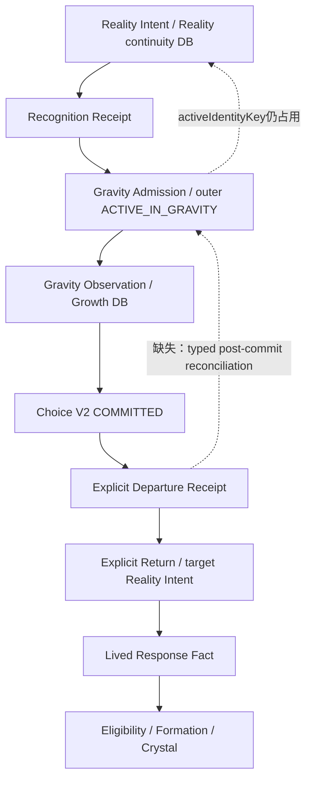
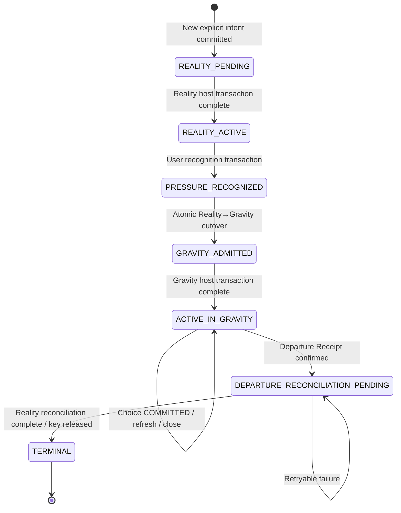

# XINMAI Reality / Gravity / Departure Lifecycle Reconciliation and Active Identity Key Release Atomic Migration Audit P0

## 0. 裁决摘要

```text
任务：
XINMAI-REALITY-GRAVITY-DEPARTURE-
LIFECYCLE-RECONCILIATION-AND-
ACTIVE-IDENTITY-KEY-RELEASE-
ATOMIC-MIGRATION-AUDIT-P0

交通灯：RED
刀型：Migration Audit / Cross-lifecycle Reconciliation
决策：AUDIT ONLY

审计基线：
3c61247a1045fb530deef2da370b0f25de64c9cc

缺陷证据候选：
598499c0d8fe9607b85fffe62ceb14ede1d4c8b0
仅作复现证据；不是修复基线
```

本审计的唯一架构答案是：

> `activeIdentityKey` 不在进入 Gravity 时释放，不在 Choice `COMMITTED` 时释放；它在用户完成 **Explicit Departure**、Growth 事务已确认唯一 Departure Receipt 之后，才允许由 Reality Adventure Continuity 的唯一 key-release Owner 在独立、幂等的 Reality IndexedDB 事务中终结当前 Gravity lifecycle 并释放。

这里的“在 Explicit Departure 释放”必须精确理解为两步 Saga：

```text
Growth Transaction Complete
→ Departure Receipt 成为用户离场事实
→ typed Departure Reconciliation Proof
→ Reality Continuity readwrite transaction complete
→ Gravity Admission TERMINAL / outer TERMINAL
→ activeIdentityKey 移除
→ Departure Reconciliation Confirmed
```

两个数据库之间没有原子事务。不得把 Growth receipt 写入与 Reality key 释放描述为一次跨库原子提交。产品可以在第一步后确认“离场事实已经保存”，但在第二步完成前只能进入 `DEPARTURE_RECONCILIATION_PENDING / SAFE_WITHHELD_RETRYABLE`，不得开放 Explicit Return 或创建 target Encounter。

最终裁决：

```text
NOW — CORRECTIVE ATOMIC MIGRATION APPLICATION READY
```

“Atomic”只指每个数据库内部事务以及同一交付提交中的消费者原子切换；跨库协调采用 typed proof、确定性 ID、幂等重试、revision/fencing 复验和 forward compensation。

---

## 1. 审计边界与证据

### 1.1 本刀只读范围

审计了当前生产源码中的：

- Reality Encounter Intent types、Controller 与 canonical transactional store；
- Reality → Gravity cutover transaction；
- Gravity Entry Admission Controller 与恢复；
- Gravity Observation Continuity 与 Growth transactional store；
- Choice V2、Explicit Departure / Return、Lived Response、Eligibility、Formation；
- `GravityPage`、`LaunchLab`、`RealityProductionRouteEntry`、正式回访 Surface；
- 直接相关 Gate scripts 与既有协议文档。

本提交不得包含 Runtime、Storage、Schema、Gate、Renderer、CSS 或页面文案修改。

### 1.2 已确认的缺陷事实

```text
inner Reality Intent
= TERMINAL / ENCOUNTER_COMPLETED

outer Reality Adventure Continuity
= ACTIVE_IN_GRAVITY

activeIdentityKey
= 仍占用

RETURNING_LIFE_WORLD request
→ 直接构造新 Intent / Cycle
→ 相同 activeIdentityKey
→ IndexedDB unique index ConstraintError
→ UNIQUE_CONSTRAINT_REJECTED
→ SAFE_WITHHELD
```

Authority Safety 是正确的：第二个 active cycle 没有被写入，既有资产没有被删除。缺口在于上游 lifecycle reconciliation 未建立，底层唯一索引成了过晚、过于粗糙的阻断器。

### 1.3 Candidate 归因

`598499c…` 相对其父提交的 C2 Single-Presenter 差异没有修改 Reality Intent Controller、Reality Adventure Store、Gravity lifecycle 或 Choice Departure / Return Authority。

因此：

```text
Candidate Unique：NO
C2 Presentation Cause：NO
Inherited Lifecycle / Recovery Gap：YES
```

---

## 2. 当前正式生产者 / 消费者清点

| 资产 / 状态 | 正式类型 | 唯一生产者 / Writer | Canonical Store | 主要消费者 | 当前缺口 |
|---|---|---|---|---|---|
| Reality Encounter Intent | `RealityEncounterIntent` | `XinmaiRealityEncounterIntentController` | `xinmai-reality-adventure-continuity` | Reality Route、cutover、Choice Return proof | terminal inner 与 outer lifecycle 缺 cross-field invariant |
| Recognition Receipt | `RealityPressureRecognitionReceipt` | Pressure Recognition Controller，经同一 Reality continuity transaction 写入 | 同上 | Reality→Gravity cutover | 无本刀新 Authority 问题 |
| Reality→Gravity Transfer | `RealityToGravityTransferProof` | `RealityToGravityCutoverTransaction` | 同上 | Gravity Admission / Recovery | 正式终结 inner Reality，但保留 active key |
| Gravity Admission | `GravityEntryAdmission` | `RealityToGravityEntryAdmissionController` | 同上 | Gravity Route、Observation | `terminateGravityEntry()`可清 key，但没有消费 Choice Departure |
| Outer Reality Adventure Continuity | `RealityAdventureEncounterContinuityRecord` | 多 Controller 通过同一 transactional store 写入 | 同上 | Reality / Gravity recovery | `activeIdentityKey` release 没有唯一 lifecycle Owner |
| Gravity Observation Continuity | `GravityObservationContinuityRecord` | `XinmaiGravityEncounterContinuityController` | `xinmai-lived-growth-canonical` 的 observation store | Choice Controller / Gravity recovery | Choice 后变 `CONSUMED_BY_CHOICE`，不等于离场 |
| Choice V2 | `ChoiceActionIntentionV2` | `XinmaiChoiceActionIntentionController` | Growth canonical envelope | Departure、Return、Fact | `COMMITTED` 只是选择意愿 |
| Explicit Departure Receipt | `XinmaiChoiceExplicitDepartureReceipt` | `XinmaiChoiceReturningProvenanceController` | Growth canonical envelope | Returning admission / Explicit Return | 写 Receipt 后未协调 Reality outer lifecycle |
| Explicit Return / target Encounter | `XinmaiChoiceExplicitReturnReceipt` + `RealityEncounterIntent(origin=CHOICE_RETURN)` | Reality Intent Controller 建 target；Growth Controller 写 Return Receipt | 两个不同 DB | Lived Response Surface / Reality proof | Return request 已有 source retirement 逻辑，但依赖尚未冻结的 Departure reconciliation |
| Lived Response Fact | `LivedResponseFact` | `XinmaiLivedResponseAuthorityController` | Growth canonical envelope | Eligibility / Formation / Reality handoff | Fact 与 Return receipt 消费已在同一 Growth transaction |
| Eligibility | `CrystalEligibility` | `XinmaiCrystalEligibilityAuthority` | Growth DB | Formation Orchestrator | 不拥有 lifecycle/key |
| Formation Receipt / Crystal | `CrystalFormationReceipt` | Production Formation Orchestrator + existing Formation Authority | Growth DB | C1、Body Imprint、Reality handoff | 不拥有 lifecycle/key |

### 2.1 当前消费图



页面 `data-*`、DOM、Canvas、Renderer、路由 state、定时器和浏览器生命周期均不是上述任何状态的 Authority。

---

## 3. 各状态机的真实含义

### 3.1 Reality Encounter Intent

```text
READY_TO_ENTER_REALITY
→ ACCEPTING_REALITY
→ ACTIVE_IN_REALITY
→ TERMINAL

失败：FAILED_RETRYABLE / RECOVERING
```

`RealityToGravityCutoverTransaction` 把 `ACTIVE_IN_REALITY` 原子推进为：

```text
inner intent = TERMINAL / ENCOUNTER_COMPLETED
outer lifecycle = GRAVITY_ADMITTED
gravity admission = READY_TO_ENTER_GRAVITY
```

裁决：进入 Gravity **终结原 Reality Encounter**，但不终结整次 Reality Adventure。原 Encounter 已被 Gravity continuation 正式承接。

### 3.2 Recognition Receipt

```text
RECOGNIZED
→ CONSUMED_BY_GRAVITY_TRANSFER
→ 可在整次冒险终结时保持历史消费状态
```

已消费 Receipt 不需要为了释放 key 被改写成新事实；其 transfer/admission 引用必须保留。

### 3.3 Gravity Admission / outer continuity

```text
TRANSFER_PREPARED
→ READY_TO_ENTER_GRAVITY
→ ACCEPTING_GRAVITY
→ ACTIVE_IN_GRAVITY
→ TERMINAL
```

Outer lifecycle：

```text
REALITY_PENDING
→ REALITY_ACTIVE
→ PRESSURE_RECOGNIZED
→ GRAVITY_ADMITTED
→ ACTIVE_IN_GRAVITY
→ TERMINAL
```

`activeIdentityKey` 表示“同一 identity 目前只有一条未终结的 Reality Adventure continuity”。它不是页面位置，也不是当前是否打开 App。

### 3.4 Gravity Observation / Choice

```text
Observation CURRENT
→ OBSERVATION_RECOGNIZED
→ CONSUMED_BY_CHOICE

Choice
→ COMMITTED
```

Choice `COMMITTED` 只表示用户选择准备尝试什么。它可以恢复 Choice Continuation，但不能证明用户已离开产品。因此 Choice commit 不得释放 key。

### 3.5 Departure / Return / Fact / Formation

```text
COMMITTED
→ Explicit Departure Receipt / DORMANT_DEPARTURE
→ Explicit Return
→ target Reality Intent
→ Return Receipt / READY_FOR_LIVED_RESPONSE
→ Fact + Return consumption
→ Eligibility
→ Formation Receipt + Crystal
→ 同一 target /reality 承接
```

Departure 是离开产品进入真实生活的用户事实；Return 是用户明确回来并请求承接的事实；Fact 是用户明确报告现实中发生什么；它们不得互相替代。

---

## 4. 当前冲突的精确形成时序

### 4.1 已有合法事务

```text
1. Reality active + Pressure recognized
2. RealityToGravityCutoverTransaction（Reality DB 单事务）
   - inner Reality Intent = TERMINAL / ENCOUNTER_COMPLETED
   - Recognition Receipt = CONSUMED_BY_GRAVITY_TRANSFER
   - Transfer + Gravity Admission 写入
   - outer = GRAVITY_ADMITTED
   - activeIdentityKey 保留
3. Gravity Host typed minimum outcome
4. Gravity Admission transaction
   - admission = ACTIVE_IN_GRAVITY
   - outer = ACTIVE_IN_GRAVITY
   - activeIdentityKey 保留
5. Observation recognized
6. Choice transaction
   - Observation = CONSUMED_BY_CHOICE
   - Choice = COMMITTED
   - Reality outer record 未改变
7. Explicit Departure Growth transaction
   - Departure Receipt = DORMANT_DEPARTURE
   - Reality outer record 未改变
```

### 4.2 缺失消费者

当前 `confirmXinmaiChoiceExplicitDeparture()` 在 Growth transaction complete 后直接返回 `DEPARTED`；没有正式 post-commit consumer 读取已确认 Receipt、复验 source Reality/Gravity lineage、终结 Gravity Admission、推进 outer lifecycle 或释放 key。

因此 `activeIdentityKey` 仍由旧 `ACTIVE_IN_GRAVITY` record 占用。

### 4.3 为什么新请求直接撞唯一索引

`requestRealityEncounter()` 对 `CHOICE_RETURN` 有特定 source-cycle retirement 分支；对普通 `RETURNING_LIFE_WORLD` 没有 lifecycle reconciliation：

```text
active identity lookup
→ 找到 inner TERMINAL / outer ACTIVE_IN_GRAVITY record
→ inner state TERMINAL，不进入 existing-active 分支
→ 构造新 record
→ 新 record 使用相同 activeIdentityKey
→ unique index 拒绝
```

该 unique index 正确保护：

> 同一 identity 不得同时拥有两个未终结的 Reality Adventure continuity record。

问题不是索引太严格，而是 Controller 在创建新 Intent 前没有取得“旧 adventure 已被明确离场并完成 reconciliation”的 typed proof。

---

## 5. 产品语义冻结

### 5.1 进入 Gravity

```text
原 Reality Encounter：终结 / superseded
整次 Reality Adventure：继续 active
activeIdentityKey：保留
```

理由：Gravity 是同一次 Reality Adventure 的内部阶段，而不是用户离开产品。

### 5.2 Choice COMMITTED

```text
Choice：正式成立
Observation：原子消费
Gravity / outer Adventure：仍 active
activeIdentityKey：保留
```

理由：Choice 是行动意愿，不是离场证明。

### 5.3 Explicit Departure

唯一正式离场动作：

```text
用户点击“带着这一步，回到生活”
↓
Growth transaction complete
↓
Departure Receipt 正式成立
↓
Reality reconciliation transaction
↓
Gravity Admission TERMINAL / EXPLICIT_LEAVE
outer lifecycle TERMINAL / EXPLICIT_LEAVE
activeIdentityKey released
```

因此唯一答案是：**Explicit Departure**。

Receipt 成立不依赖页面关闭、导航、时间或 key 释放成功；但 Explicit Return admission 必须等待 reconciliation confirmed。

### 5.4 未 Departure 的恢复

以下事件均保持旧 Adventure active：

- Choice commit 后刷新；
- 浏览器关闭 / 重新打开；
- Back / Forward；
- App 进入后台；
- 等待一段时间；
- Direct URL；
- 返回 LaunchLab。

消费者只能恢复 Gravity / Choice Continuation，或给出 typed “当前同行尚未离场”的入口；不得自动创建新 Reality。

### 5.5 Explicit Return

只有同时满足：

```text
Departure Receipt current
+ source Adventure Reconciliation Confirmed
+ activeIdentityKey 已从 source record 释放
+ 用户明确点击“我回来了”
```

才允许建立或恢复确定性的 `CHOICE_RETURN` Intent 与 target cycle。

### 5.6 尚未尝试 / 拒绝记录

Explicit Return 已建立 target Intent，但 no-fact Growth transaction 完成后：

```text
Return Receipt = RESOLVED_WITHOUT_FACT
Choice / Departure = 回到可继续同行的 dormant 关系
target Reality Intent = 幂等终结
target activeIdentityKey = 由同一 key-release Owner 释放
/reality = 不进入
```

如果 target termination 失败，Growth no-fact outcome 保持权威；Recovery 只重试 termination，不重开表单、不生成 Fact。

### 5.7 已尝试 / 改变回应 / Formation

```text
唯一 target Intent
→ Return Receipt
→ Fact + Return consumption（Growth 单事务）
→ Eligibility / Formation
→ 同一 target /reality admission
```

此时 target key 不释放，因为 target Reality Adventure 正在开始。导航失败只重试相同 target，不创建第二 cycle。

---

## 6. activeIdentityKey 所有权契约

### 6.1 唯一生成者

`XinmaiRealityEncounterIntentController` 只能在创建新的 canonical Reality Adventure record 时，根据：

```text
sourceReferenceId
starBeastIdentityReferenceId
mansionCoordinateReferenceId
```

确定性生成 `activeIdentityKey`。

页面、路由、Growth Store、Recovery Adapter 和 Renderer 不得生成或复制它作为 Authority。

### 6.2 唯一释放 / 替换 Owner

Runtime migration 必须建立单一逻辑 Owner：

```text
XinmaiRealityAdventureLifecycleReconciliationController
```

它是 `activeIdentityKey` 的唯一 release/replace Authority，并且只能通过 `XinmaiRealityAdventureContinuityTransactionalStore` 写入。

现有以下直接释放路径必须委托给该 Owner，或使用同一内部 mutation primitive：

- `terminateRealityEncounter()`；
- `terminateGravityEntry()`；
- `requestRealityEncounter()` 中的 expired / start-new retirement；
- 新增 Explicit Departure reconciliation；
- no-fact target termination。

不允许页面直接清 key，也不允许 Growth Controller 写 Reality DB。

### 6.3 占用规则

| Outer lifecycle | activeIdentityKey |
|---|---|
| `REALITY_PENDING` | REQUIRED |
| `REALITY_ACTIVE` | REQUIRED |
| `PRESSURE_RECOGNIZED` | REQUIRED |
| `GRAVITY_ADMITTED` | REQUIRED |
| `ACTIVE_IN_GRAVITY` | REQUIRED，直到 Explicit Departure reconciliation complete |
| `TERMINAL` | FORBIDDEN |

新增 validator invariant：

```text
outer.lifecycle === TERMINAL
⇔ activeIdentityKey === undefined

outer.lifecycle !== TERMINAL
⇔ activeIdentityKey === deterministic(identityReferences)
```

Inner Reality Intent 在进入 Gravity 后可以是 `TERMINAL / ENCOUNTER_COMPLETED`，但这不能单独触发 key 释放；outer lifecycle 才表达整个 Adventure 是否仍 active。

### 6.4 Terminal audit preservation

Terminal record 必须保留：

- original intent；
- Recognition Receipt；
- Transfer；
- Gravity Admission；
- revisions/fencing；
- Departure reconciliation proof；
- terminal timestamps/reason。

只移除 unique active key，不删除历史 record。

### 6.5 Revision / fencing

Reality transaction 必须在同一 readwrite transaction 中：

```text
重读 source record
→ 校验 identity / source cycle / gravity refs
→ 校验 expected canonicalRevision / fencingToken 不倒退
→ terminalize Gravity + outer
→ 写 reconciliation proof
→ 移除 activeIdentityKey
→ revision / fencing +1
```

Revision/fencing 只保护 Reality DB 内的 stale writer；它们不构成跨数据库 CAS。

---

## 7. Revised logical schema

### 7.1 物理存储裁决

```text
Reality DB physical version：保持 1
Object Store：不新增
Index：不新增
Writer：不新增
```

现有 optional `activeIdentityKey` unique index 足够保护单 active adventure。

### 7.2 Logical record V2

需要逻辑 V2，以永久记录已发生的 cross-store reconciliation，而不是仅凭 `TERMINAL` 猜测离场：

```ts
type RealityAdventureDepartureReconciliation = Readonly<{
  schemaVersion: "XINMAI_REALITY_GRAVITY_DEPARTURE_RECONCILIATION_V1";
  reconciliationReferenceId: string;
  departureReceiptReferenceId: string;
  departureReceiptRevision: number;
  choiceActionIntentionReferenceId: string;
  sourceEncounterCycleId: string;
  gravityCycleId: string;
  gravityObservationReferenceId: string;
  identityReferences: RealityEncounterIdentityReferences;
  observedGrowthEnvelopeRevision: number;
  reconciledCanonicalRevision: number;
  reconciledFencingToken: number;
  state: "EXPLICIT_DEPARTURE_RECONCILED";
  reconciledAt: string;
  provenance: {
    departureAuthority: "XINMAI_LIVED_GROWTH_TRANSACTION_AUTHORITY";
    realityAuthority: "XINMAI_REALITY_ADVENTURE_CONTINUITY";
    crossStoreAtomicityClaim: false;
    noActionCompletionClaim: true;
  };
}>;
```

`reconciliationReferenceId` 必须由以下稳定引用确定性派生，不含时间或页面状态：

```text
departureReceiptReferenceId
+ choiceActionIntentionReferenceId
+ sourceEncounterCycleId
+ gravityCycleId
+ gravityObservationReferenceId
+ identity references
```

`RealityAdventureEncounterContinuityRecordV2` 增加：

```text
departureReconciliation:
  RealityAdventureDepartureReconciliation | null
```

### 7.3 V1策略

- V1 继续可读；
- 不扫描、批量改写或 backfill；
- V1 active record + 无 Departure Receipt：保持 active；
- V1 active record + current Departure Receipt：用户/恢复流程触发 on-demand typed reconciliation，首次合法写入 V2；
- V1 terminal record：保留只读，不补造 Departure proof；
- 无 Receipt 的历史记录不得被解释为用户明确离场。

---

## 8. 跨库 Saga

### 8.1 唯一推荐协调方式

```text
typed proof
+ deterministic command IDs
+ idempotent reconciliation
+ fresh read / version validation
+ fencing inside each DB
+ terminal tombstone
+ retryable compensation
```

不建立跨库事务管理器，不新增数据库，不新增页面 Storage，不新增第二 Writer。

### 8.2 Explicit Departure Saga

```text
Step G1 — Growth DB
用户明确点击 Departure
→ Growth transaction 重读 Choice / identity / route / observation
→ 写或恢复确定性 Departure Receipt
→ transaction complete
→ 离场事实成立

Step R1 — typed read
唯一 Growth Recovery Adapter 重读 current Receipt + Choice
→ 形成 read-only Departure Reconciliation Proof Snapshot

Step R2 — Reality DB
Lifecycle Reconciliation Controller 重读 source encounter
→ 校验 identity / source cycle / admission / gravity cycle / observation
→ 若已 exact reconciled：ALREADY_RECONCILED
→ 若 active current：写 V2 reconciliation + terminalize Gravity/outer + clear key
→ transaction complete

Step P1 — Presentation
R2 complete：DORMANT_DEPARTURE
R2 pending/failure：DEPARTURE_RECONCILIATION_PENDING，真实可重试
```

### 8.3 半事务与补偿

| 断点 | 权威结果 | Recovery |
|---|---|---|
| Growth commit 前失败 | 无 Departure Receipt；key 保留 | 重试 G1 |
| Growth commit 后、Reality 调用前崩溃 | Departure 成立；key 暂留 | Recovery Adapter 发现 Receipt，重试 R1/R2 |
| Reality transaction abort | Departure 成立；key 保留 | 同一 reconciliation ID 重试 |
| Reality transaction complete、页面崩溃 | key 已释放；proof 在 source record | 恢复 `ALREADY_RECONCILED` |
| Reality complete、旧标签晚到 | fencing / lifecycle / exact proof 复验 | 只恢复，不重开 active key |
| Presentation失败 | 两侧事实保留 | 只重试 presentation |

任何失败不得删除 Departure Receipt、旧 Encounter、Choice、Fact、Crystal 或 Body Imprint。

### 8.4 Explicit Return Saga

```text
用户点击“我回来了”
→ Growth Adapter 读取 Departure
→ Reality Adapter 读取 source reconciliation proof
→ proof current 才允许 request CHOICE_RETURN
→ Reality transaction：
   lookup source cycle
   validate terminal + reconciliation refs
   create/recover exactly one target record
   source record remains terminal without active key
→ Growth transaction 写 Return Receipt
```

若 Reality target 已创建但 Growth Return Receipt 写入失败，确定性 `returnIntentRequestReferenceId + returnAttemptRevision` 必须恢复同一个 target；不得生成第二 target。

### 8.5 No-fact target compensation

Growth no-fact transaction 成功后，Lifecycle Reconciliation Controller 终结 target Intent/outer record并释放 target key。若失败，返回 typed retry，不删除 Growth resolution；Direct URL 与 Reality admission 必须读取 Growth resolution proof并拒绝激活。

---

## 9. Recovery / Reconciliation 矩阵

| 恢复输入 | 目标动作 | key 结果 | 说明 |
|---|---|---|---|
| inner `TERMINAL/ENCOUNTER_COMPLETED` + outer `ACTIVE_IN_GRAVITY`，无 Choice | `RECOVER` | 保留 | 恢复 Gravity active |
| Choice `COMMITTED` + no Departure | `RECOVER` | 保留 | 恢复 Choice Continuation；不推测离场 |
| Departure Receipt exists + outer active | `RECONCILE` → `TERMINATE` | 成功后释放 | 读取 typed Growth proof；幂等写 V2 |
| Departure exists + Reality unavailable/blocked | `RETRY` + presentation pending | 保留 | 离场事实保留，Return 不开放 |
| Departure exists + source refs mismatch | `SAFE_WITHHELD` | 不变 | 不猜测、不删资产 |
| Return Receipt exists + source old key 仍占用 | `SAFE_WITHHELD` → source reconciliation retry | 成功后 source 释放；target 保持 | 不创建第二 target |
| target intent exists + source lifecycle late writer | `RECOVER target`; stale source write rejected | target key 唯一 | unique index + fencing |
| 同一 Departure 多标签 reconcile | `ALREADY_RECONCILED` | 释放一次 | 确定性 reconciliation ID |
| 同一 Return 多标签 | `RECOVER same target` | target key 一个 | 确定性 request ID |
| 旧标签 expected revision 落后 | `SAFE_WITHHELD / RETRY_FRESH_READ` | 不变 | 不覆盖新 record |
| transaction abort / close / quota / blocked | `RETRY` | 未完成事务不改变 | success only on IDB complete |
| corruption / invalid schema | `SAFE_WITHHELD` | 不变 | 禁止自动修复/删除 |
| Direct URL | `SAFE_WITHHELD` 或恢复已证明 target | 不新建 | 路由不是事实生产者 |
| refresh / Back / Forward | `RECOVER` | 不变 | 只读恢复 |
| V1 active + current Departure proof | on-demand `RECONCILE` to V2 | 成功后释放 | 合法 forward completion，不是 backfill |
| V1 active + no Departure proof | `RECOVER` | 保留 | no backfill |
| V1 terminal + no reconciliation field | read-only history | 无 key | 不补造用户离场事实 |
| no-fact Growth resolved + target active | `TERMINATE / RETRY` | 成功后释放 target | 不进入 `/reality` |
| Fact/Formation confirmed + target active | `RECOVER target` | 保留 target | 允许同一 `/reality` 承接 |

---

## 10. Target 状态机

### 10.1 Outer Adventure target lifecycle



`DEPARTURE_RECONCILIATION_PENDING`可以是跨域 typed admission 状态，不必成为 outer record 的持久 lifecycle 枚举；Reality record 在 R2 完成前仍保持 `ACTIVE_IN_GRAVITY`，以诚实表达 key 尚未释放。

### 10.2 Returning product admission

```text
RESUME_COMMITTED
→ DEPARTURE_COMMITTING
→ DEPARTURE_RECONCILIATION_PENDING
→ DORMANT_DEPARTURE
→ RETURN_INTENT_ESTABLISHING
→ READY_FOR_LIVED_RESPONSE
→ RESUME_REPORTED / TERMINAL_BY_GROWTH

任一 proof / storage / identity mismatch
→ SAFE_WITHHELD
```

只有 `DORMANT_DEPARTURE` 可以显示“我回来了”；只有 `READY_FOR_LIVED_RESPONSE` 可以挂载回访表单。

### 10.3 Generic `RETURNING_LIFE_WORLD`

当 active identity lookup 找到旧 record：

- nonterminal Reality：恢复同一 Encounter 或 typed active conflict；
- outer active Gravity、无 Departure：返回 `ACTIVE_ADVENTURE_REQUIRES_CONTINUATION`；
- Departure pending：返回 `DEPARTURE_RECONCILIATION_REQUIRED`；
- terminal source：只有没有 active key 且当前产品协议允许普通新 Reality 时才可创建；Choice lineage 必须走 `CHOICE_RETURN`，不能降级成 generic request。

`UNIQUE_CONSTRAINT_REJECTED` 只能是最后防线，不能是产品级 recovery outcome。

---

## 11. Consumer Cutover

### 11.1 必须同一 Runtime 交付单位完成

| 消费者 | 当前行为 | 目标行为 |
|---|---|---|
| `GravityPage` | Departure 只写 Growth Receipt | 调用单一 Departure Saga outcome；pending / dormant typed 呈现 |
| Choice Controller / Host | Choice 后进入 continuation | 保持；Choice 不终结 Gravity |
| `XinmaiChoiceReturningProvenanceController` | Growth Receipt 后直接返回 departed；Return 直接 request target | Departure 后调用 coordinator；Return 要求 reconciled proof |
| 新 Lifecycle Reconciliation Controller | 不存在 | active key 唯一 release/replace Owner |
| `XinmaiRealityEncounterIntentController` | generic terminal-inner record可落入 direct create | 创建前消费 reconciliation decision；退休逻辑委托唯一 Owner |
| `XinmaiGravityEntryAdmissionController` | 自己直接 clear key | 委托唯一 release primitive；保留 Gravity admission authority |
| `LaunchLab` Returning | generic `RETURNING_LIFE_WORLD` request 静默撞 unique | 消费 typed active/pending/ready outcome；不得 blind create |
| Returning Surface | Receipt 即 `DORMANT_DEPARTURE` | 增加 reconciliation pending；仅 confirmed 显示 Return CTA |
| Reality Route | target proof admission | 保持；no-fact / stale target 拒绝 |
| Reality / Gravity Recovery Adapters | 分别恢复自身 | 通过公共 reconciliation read model 输出一致状态 |
| Gate scripts | 未覆盖 Departure→key release | 同步加入唯一 Owner、V1、并发、no direct-create 断言 |

### 11.2 禁止并存

```text
新 reconciliation path
+ 旧 terminal-inner → direct create path

新 DORMANT_DEPARTURE gate
+ Receipt-only Return admission

新 unique key Owner
+ terminateGravityEntry / terminateRealityEncounter 各自直接 clear

新 typed outcome
+ 页面根据 UNIQUE_CONSTRAINT_REJECTED 猜测恢复
```

必须以单提交消费者 cutover 完成，不能先释放 key、后补 Return proof gate。

---

## 12. 原子迁移文件边界

Runtime Application 应从届时最新远程 HEAD 建立全新候选；不得基于 `598499c…` 修补。建议单提交范围：

### 12.1 Types / schema validators

- `src/types/xinmaiRealityAdventureContinuity.ts`
- `src/types/xinmaiRealityEncounterIntent.ts`
- `src/types/xinmaiChoiceReturningProvenance.ts`
- 必要时新增 `src/types/xinmaiRealityGravityDepartureReconciliation.ts`

### 12.2 Single Owner / proof / transactional boundary

- 新增 `src/services/xinmaiRealityAdventureLifecycleReconciliationController.ts`
- 新增 `src/services/xinmaiChoiceDepartureReconciliationProofAdapter.ts`
- `src/services/xinmaiRealityAdventureContinuityTransactionalStore.ts`
- `src/services/xinmaiRealityEncounterIntentController.ts`
- `src/services/xinmaiGravityEntryAdmissionController.ts`

### 12.3 Cross-store Saga / recovery consumers

- `src/services/xinmaiChoiceReturningProvenanceController.ts`
- `src/services/xinmaiChoiceReturningProvenanceRecoveryAdapter.ts`
- `src/services/xinmaiChoiceReturningProvenanceAdmissionResolver.ts`
- `src/services/xinmaiChoiceReturningRealityProofAdapter.ts`
- 直接相关 mutation policy

### 12.4 Hosts / routes

- `src/pages/GravityPage.tsx`
- `src/pages/LaunchLab.tsx`
- `src/pages/RealityProductionRouteEntry.tsx`
- `src/components/XinmaiLivedResponseReturnSurface.tsx`

### 12.5 Gates

- 新增 lifecycle reconciliation authority / browser contract gates；
- 更新 reality-adventure continuity、choice-returning provenance、Gravity observation、Direct URL 与 no-backfill gates；
- `package.json` 只注册直接相关 Gate。

不允许修改 Renderer、C2 visual facts、Canonical Body Imprint、Formation Authority、AI、Prompt Runtime、商业研究或 Phase 4。

---

## 13. Forward SAFE_WITHHELD Counter

Counter 必须是最终 Runtime Candidate 的直接子提交，只做 forward policy change：

```text
Lifecycle Reconciliation Mutation：PAUSED
New Explicit Departure Saga：SAFE_WITHHELD
New Explicit Return / target creation：SAFE_WITHHELD
Generic new Reality while unresolved active record：SAFE_WITHHELD
```

Counter 必须保留：

- V1/V2 Reality records；
- active / terminal key ownership事实；
- Choice、Departure、Return、Fact、Eligibility、Formation、Crystal、Body Imprint；
- C1 Ownership 与 C2 typed facts；
- 已完成的 reconciliation proof；
- 既有 active adventure 的只读恢复与安全提示。

Counter 禁止：

- 恢复 terminal-inner → direct create；
- 恢复 Receipt-only Return admission；
- 把 key 写回 terminal record；
- 删除 reconciliation proof；
- 删除或回滚用户 Growth 资产；
- 使用普通 git revert 复活旧消费者。

---

## 14. Browser / transaction 验收矩阵

### 14.1 正向主线

```text
Reality
→ Gravity
→ Choice COMMITTED（key仍在）
→ Explicit Departure Receipt
→ reconciliation pending / complete
→ source key释放
→ Dormant
→ Explicit Return
→ exactly one target cycle / key
→ Lived Response
→ Fact + Return atomic consumption
→ Formation
→ same target /reality
```

### 14.2 必测断言

- 进入 Gravity：inner terminal、outer active、key 1；
- Choice commit：key 仍为 1；
- refresh / close / Back / Forward：不释放；
- Departure Growth transaction 前：不释放；
- Departure Growth complete、Reality reconciliation 前：Receipt 1、key仍在、Return入口 0；
- reconciliation complete：source key 0、proof 1、历史 record 保留；
- Explicit Return：target key 1、source key 0、target cycle 1；
- Return双击/双标签：同一 target；
- Fact成功：同一 target，不重复 Fact/Formation；
- no-fact：target幂等终结并释放；
- generic Returning 遇 active Gravity：typed continuation，不出现 unique error；
- Direct URL：不补造 Departure / reconciliation / Return；
- V1 active + no Receipt：保持；
- V1 active + Receipt：on-demand V2 reconcile；
- corrupted/mismatch：SAFE_WITHHELD；
- transaction abort / quota / blocked / connection close：无半写、可重试；
- stale tab：fencing reject；
- new target exists + old late writer：最终 active key 仍唯一；
- Growth / Reality 任一库暂时不可用：不删除另一侧资产。

### 14.3 用户结果

| 回访结果 | Fact | target Reality | key结果 |
|---|---:|---|---|
| 已尝试 | 1 | 同一 target 进入 `/reality` | target key保留 |
| 改变回应 | 1 | 同一 target 进入 `/reality` | target key保留 |
| 尚未尝试 | 0 | 不进入；target终结补偿 | target key释放 |
| 拒绝记录 | 0 | 不进入；target终结补偿 | target key释放 |

### 14.4 产品反馈

以下 typed feedback 必须可见、克制、可重试：

- Departure 已保存，生命周期仍在协调；
- 当前同行尚未离场，请继续原 Choice；
- Return 暂时无法建立，既有离场与成长资产保留；
- storage / identity / stale mismatch 的安全扣留。

不得把底层 `UNIQUE_CONSTRAINT_REJECTED` 直接展示给用户，也不得静默返回。

---

## 15. 风险与不变量

### 15.1 不得改变

- Identity / Mother Code；
- Reality Pressure Recognition；
- Gravity Observation Authority；
- Choice V2 与七类 Action Route；
- Fact / Eligibility / Formation / Crystal；
- Canonical Body Imprint；
- C1 / C2 Presentation；
- Phase 4；
- AI / Prompt Runtime。

### 15.2 核心不变量

```text
One identity
→ at most one active Reality Adventure key

Choice committed
≠ explicit departure

Departure receipt
→ user departure fact
≠ cross-store transaction complete

Return admission
→ requires reconciled departure proof

Terminal record
→ preserved audit history
→ activeIdentityKey absent

Any uncertainty
→ SAFE_WITHHELD
→ no deletion / no guessed success
```

---

## 16. 最终裁决与阶段状态

现有两个事务域足以承载修复：

- Growth DB 已能确定性写 Departure / Return / Fact；
- Reality Adventure DB 已能在单 transaction 中 retained-record + new-record 写入并受 unique index / fencing 保护；
- 无需新 DB、Object Store 或物理版本升级；
- 需要 Reality record logical V2 与唯一 reconciliation Owner；
- 跨库采用 Saga，不声称原子性。

因此：

```text
Migration Audit：CLOSED / PASS

Runtime Application：
NOW — CORRECTIVE ATOMIC MIGRATION APPLICATION READY

Runtime Candidate基线：
必须是申请时最新Remote HEAD

598499c：
HOLD / EVIDENCE ONLY
修复后必须重新CURRENT-HEAD重组

C2 Counter：
NOT TRIGGERED

C3：
DEFER

Phase 3：
ACTIVE / NOT PASSED

Phase 4：
LOCKED

Prompt Runtime：
DEFER

Research Execution：
BLOCKED

Monetization Runtime：
DEFER

Push：
HOLD
```

最高产品原则保持：

> 让选择的保护、收益与代价显形；让用户在现实中决定拿起什么、放下什么；系统不审判，真实行动才形成成长留痕。

本迁移只修复同一次生命冒险如何被诚实终结和恢复，不新增第二套 Relationship、Growth 或人格 Runtime。
